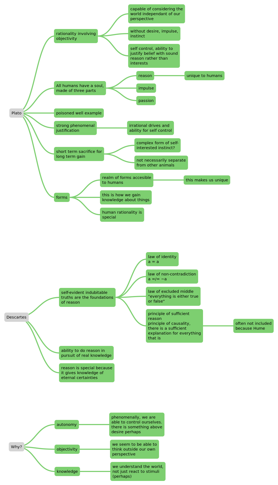
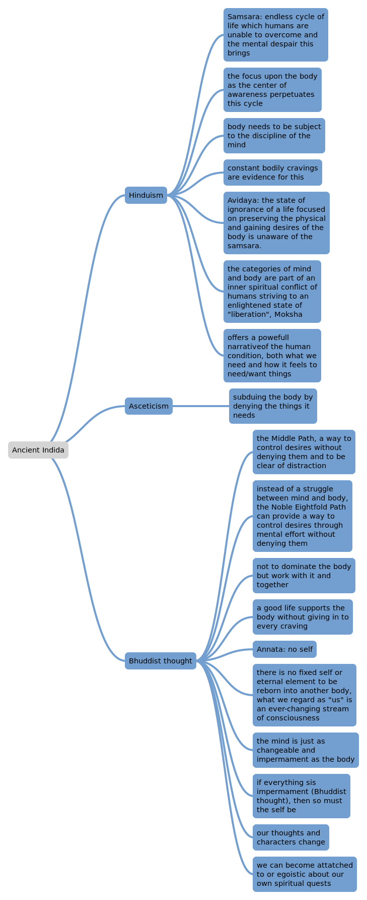
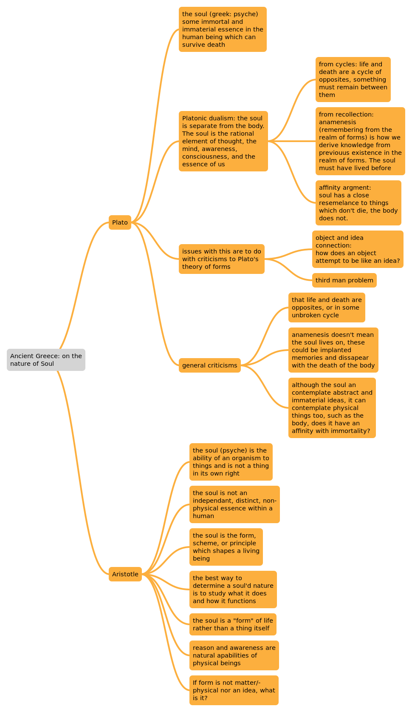
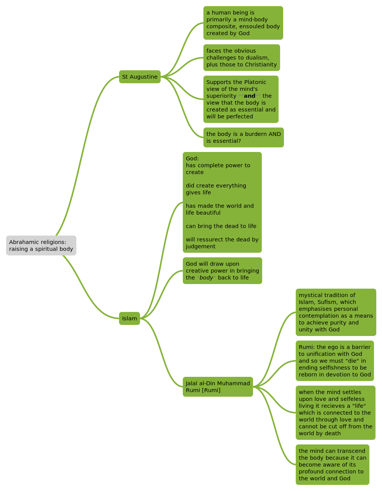

# 00 Freedom

# 01 Being and Nothingness

***—An essay on phenomenological ontology***

## Introduction

- An ontological analysis of human existence using the phenomenological method

- Exposed to ideas of Husserl and Heidegger at the French Institute in Berlin.
    - Discovered phenomenology—”the study of structure of the structures of experience in consciousness.”
- Published “Nausea”.
    - Thought that the medium of the novel helped to understand philosophical problems in a different way as a treatise.
- Published during German occupation of France and after having served in the army.
- “Existence precedes essence”

***

## Nothingness

Husserl, The intentionality thesis: ”all thought is intentional” (nature of thought thought is directed to/about objects).

- Sartre thinks this has unintended consequences:

“\[Sartre thinks there is no\] transcendental ego in the sense of an *a priori* structure of consciousness that predetermines the unity of beliefs and perceptions.”—Joseph Catalano, *Good Faith and Other Essays* (1990), p. 135

- **Sartre doesn’t deny the existence of an ego, he denies there is an ego behind consciousness as a subject.**

  > The consciousness which says ‘I think’ is precisely not the consciousness which thinks.

   —Sartre, *Transcendence of the Ego*

Only by **reflecting on the activity as one’s own** does the ego come into existence **as the intentional object of consciousness**. The ego presupposes consciousness; the self-known presupposes the self-knowing.

- It is by acting that we establish identity and allow external demands to shape our action:

  - |                        NOT                        |                             YES                              |
    | :-----------------------------------------------: | :----------------------------------------------------------: |
    | “they keep secrets because they are trustworthy.” | “We call someone trustworthy because they *have* kept our secrets.” |

- > Existence precedes essence

    - the kind of existence which precedes is ambiguous and insecure: the Socratic injunction (“know thyself”) is an impossible ideal as it is only through action that the self is defined.

- Sartre’s strong metaphysical theses about consciousness and its objects in his introduction are essential for almost all of the claims he makes.

> \[Consciousness\] is a being such that in its being, its being is in question as so far as this being implies a being other than itself.

> \[Unlike being, which\] is itself so completely that the perpetual reflection which constitutes the self is dissolved in an identity… the being of the for-itself is defined, on the contrary, as being what it is not and not being what it is.

 —*Being and Nothingness*, 18, 21

- Sartre distinguishes between being-for-itself (consciousness) and being-in-itself (fixed and static, e.g. the being-in-itself of a bookcase).

  - | Being-for-itself | Being-in-itself  |
    | ---------------- | ---------------- |
    | Consciousness    | Unthinking world |
    | Fluid, Changing  | Static           |

- **Negation is a distinct human action.**

  - Negation is “a refusal of existence.”

  - Every time we make a choice, by affirming one thing we negate others.

  - The being-for-itself is separated from the being-in-itself (unthinking world) by its unique power of negation. Through humanity, nothingness can arrive into the world.

  - The unique psychological ability to negate is dependant on an underlying ontology (theory about the nature of being and existence)

    - > The necessary condition for our saying not is that non-being be a perpetual presence in us and outside of us, that nothingness haunts being.

        —*Being and Nothingness*, 35

- **Sartre thinks there are several negative realities (e.g. absence, repulsion, otherness ) that are experienced by humans which make them seem as more than nothing.**

  - **Sartre calls these, “Négatité”.**

***

## Anxiety

- Nothingness, outside and within us, conditions our questions about being.

- Nothingness is not-existent.

- However, the Négaitité is experienced by humans.

  - We make the nothingness be through or experience.
  - Therefore there must be a being which nihilates, which brings the nothingness to things.
  - The human, as the being which brings nothingness into the world, must be its own nothingness.
  - What must the human be in its being such that through it nothingness comes into being?
    - Man must be free.
- The lived experience of nothingness implies a freedom, it is experienced as its nihilation of the self’s past being.

- Anxiety reveals freedom as the possible destroyer of the self’s present and future of what it is.

- Anxiety is anxiety before oneself, it has no object.

- It is the fear at the freedom which one has and can be with respect to one’s self.

- Anxiety is the consciousness of freedom.

- Anxiety shows the shortcoming of Cartesian epistemology.

  - If the “I” of the “I think” is the structure of consciousness, this anxiety is impossible.
  - However, with the disjunction of the self and the self-knowing: the previous “I” of the past is powerless in the face of the “I” of the present.
- Consciousness confronts its past and future as facing the self, which it is in the mode of not being.

- Freedom manifests itself by anxiety—characterised by a necessity to constantly remake the self.

- Man is always separated by a nothingness from its essence.

- This anxiety is uncomfortable, so one attempts to hides it from oneself through flight:

|                  Psychological determinism                   |                         Distraction                          |
| :----------------------------------------------------------: | :----------------------------------------------------------: |
| An attitude of excuse. Essence is fixed, it provides a nature which is productive of one’s acts. This is reassuring as it gives one an excuse. | We detach ourselves from our possibilities by considering them abstractly. |
| We deny our transcendence, preferring to take our place in the order of things (being-in-itself) instead of freedom. | We redefine something as an abstract idea not our own possibility. |

- Distraction is a more complete form of flight.

- Nature of consciousness accounts for freedom and nothingness but also requires its questioning

- We never face nothingness directly as a thing so anxiety has nothing as its object

***

## Bad Faith

> For man to be able to question, he must be capable of being his own nothingness

—*Being and Nothingness*

- Anxiety shows one’s freedom.

- Bad faith is different to lying.

  - Lying is to deceive from the other and being aware of it.
  - Bad faith is lying to oneself and concealing the self from the self.

- > What must be the being of man if he is capable of bad faith?

- **Double property of the human being:**

  - **Humans are both a facticity and a transcendence.**

- > Bad faith seeks to affirm their identity while preserving their differences. It must affirm facticity as being transcendence and transcendence as being facticity, in such a way that at the instant when a person apprehends the one, he can find himself abruptly faced with the other.

    —*Being and Nothingness*, 79

    - Bad faith can be two forms:
      - Deny the freedom/transcendence component (“I can’t do anything about it”)
      - Ignore the factical part of all situations (“I can do anything by wishing it”)

- Bad faith takes us to the root of the problem, the subject of identity.

- Bad faith would not be possible if humans are what they are (their authentic self)

- We hide our freedom from ourselves by accepting the definitions of others, e.g. “I am a waiter”

- Bad faith is belief for self-deception.

***

## The Body

- Sartre wanted to differentiate between different levels of ontology.
  - He believed his predecessors had misunderstood the body by confusing the orders of knowing and being.

- Level1: The body as being-for-itself
- Level2: The body for the others
- Level3: Third Ontological Dimension of the body

| 1—The body as being-for-itself                               | 2—The body for the Other                                     | 3—Third Ontological Dimension of the body                    |
| ------------------------------------------------------------ | ------------------------------------------------------------ | ------------------------------------------------------------ |
| “My body as it is for me does not appear to me in the midst of the world.” | The body as seen rather than lived.                          | We experience our body as reflected by other’s experiences of it. |
| Not something we can intuit as an object.                    | The body is a tool for the engagement with the world.        | “The Other is revealed to me as the subject for whom I am an object.” |
| I *am* my body, NOT I have a body.                           | It appears as a thing, so one is a thing.                    | “I cannot be embarrassed by my own body as I exist it. It is my body as it may exist for the other which may embarrass me.” |
| To be the foundation of one’s own nothingness.               | The Other’s body appears as an object.                       | The Gaze of the Other, “le regarde”.                         |
| Bodies are the axis of the relationship of the for-itself and the being for-others. | The studying of another's body and one’s own body as objects are one and the same. | We are imprisoned by the gaze of the other, the other reprieves us of control over how we see our world and ourselves. |
| The body is the centre.                                      | The realisation that bodies are a thing reveals the 3rd level. | This is a reason for accepting another’s identity in bad faith instead of being one’s authentic self. |

***

## The Look

- *Individual level*: Through negation I can chose what I can be.
- *Social level:* My freedom is only one of many freedoms, and my being is subject to the Other’s power of negation.
- “I am not the only being by which nothingness comes into the world.”
- The Other makes one no longer the centre.
- Just as the Other “steals the world”, the Other can steal “my being”
  - The gaze of the other reveals that one’s consciousness is not the only deciding factor of who one is. As there is another perspective which decides one’s essence.
  - Example of person peeping through a keyhole. “I am my actions”, there is no jealousy or shame—that comes after the gaze of the other.
- The self-known is always indeterminate as it is always subject to the freedom of others.
- The Other limits the self’s freedom.
- “In the Look there is a death of my possibilities”

***

## Freedom

- Radical Freedom
- Success is not important to freedom

|                    |                     Ontological Freedom                      | Situational Freedom                               |
| :----------------: | :----------------------------------------------------------: | ------------------------------------------------- |
| French Occupation: | Ontological freedom (of consciousness and thought, attitude) is not limited. | Situational freedom is limited (of actions, etc.) |

- No matter of situational freedom, at the level of consciousness we are ultimately free.
# 02 The Philosophy of Free Will
Masolit Lecture: notes
## Introduction

- Are we in control of our actions?
- Is it up to us what we do?
  - Why this might matter morally and for ethics
  - If we have a right to liberty
- What reason do we have to believe in freedom?

***

## What is free will?

Free will is a kind of power over alternatives.

- Power is a special kind of capacity
  - To make or prevent events
  - To produce or determine outcomes
- Causation is a type of power.
  - Throwing a brick at a window: the brick has the capacity to break the window.

Free will looks very much like causation, another capacity to make things happen.

- But, taking the brick analogy, the brick has only one capacity. We have more than one capacity to do one thing.

Power to determine more than one outcome.

Therefore, free will is a “power over alternatives”

- We are free to do more than one thing.
- Different to ordinary causation as they can only do one thing, they have no alternatives.

- Control over “external” or “voluntary” actions.
  - Voluntary because they are in effect of a prior “will” to perform them

This psychological state of intention motivates one to take this action.

This capacity to take decisions and form intentions is what is called “the will”.

- We also control whether we **decide** what we do.

Freedom starts of as a power over the Will to take decisions and form a state to take an action.

If the psychological states which move one to do something weren’t decisions one controlled and were just passive feelings which controlled one:

- What determines one to do something is an uncontrollable urge.
- Not in control over action at all.

Freedom depends on a capacity to take active decisions which we control.

***

## Problem with Free Will

Causation creates a problem of whether free will can ever exist.

It creates a skepticism about free will: our natural belief in freedom is without foundations and we might even have reason to abandon belief in freedom.

We still limited by external things but we still assume control and freedom over decisions.

Freedom as Power over alternatives:

- Being able to determine more than one action.
- Dependant on there being an alternative

| Causal determinism                                           | Incompatibalism                                              | Compatibalism                                                |
| ------------------------------------------------------------ | ------------------------------------------------------------ | ------------------------------------------------------------ |
| Maybe causation determines in advance everything (causal determinism). | Freedom is incompatible with causal determinism              | Even if causal determinism is true, we are still free        |
| Preceding events might have causally determined present events outside one’s control | Libertarianism Nevertheless, freedom is real: the world is not causally determined. | Ordinary causation and freedom are compatible                |
|                                                              | Skepticism Because causal determinism is true, we are not free. | Freedom is a causal property to the desires to do them. We reduce the power of freedom to an ordinary causal power of our desires. |
|                                                              | Decisions must be independent to our desires. Debate as to what freedom is. | Decisions are dependent on our desires. Debate as to what freedom is. |

***

## Does the problem matter?

- It matters for its own sake
- Matters to ethics:
  - Blame and punishment
  - Human rights

| Moral responsibility                                         | Liberty                                                      |
| ------------------------------------------------------------ | :----------------------------------------------------------- |
| We don’t just criticise immoral actions, we also put down their actions as **their** fault. | Coercion.                                                    |
| We put down their fault as their own actions.                | A right to liberty—to not be coerced.                        |
| They have some responsibility for being that way/acting that way. | A power over freedom, to have control over what we do.       |
| We link this to their capacity of action.                    | The right to have control one’s actions cannot exist without the power of freedom existing. |
| Faults that are peoples’ faults have arisen in them from their own doing as they have a capacity to determine how they act. They are responsible for their actions and the results of them. | Liberty based on the capacity to exercise the power of freedom and have a right to do so. |
| This is only true if the power of freedom is a power they have. | If we don’t have a capacity to determine what we do, we can’t have a right to do so. |
| If there is no such thing we can only point out the fault but or hold them morally responsible. They are not faults blamed on the person, they are just faults *in* the person. |                                                              |
| Punishment based on blaming the person for having a moral responsibility due to their power of freedom but choosing doing wrong, so they are deserving of the punishment. If there is no power of freedom then they cannot be held as deserving of punishment for something, it would be like a vase deserving punishment for having a crack or not being perfect and us punishing it for this. |                                                              |

***

## Protecting Ethics from the Free Will Problem

### Blame and punishment

Suppose that all human actions are causally determined.

What is important is that humans be causally prevented from committing actions which harm other human beings/are immoral/whatever.

So we institute practices of blame and punishment which act as causes which benefit/serve a social purpose, they deter them from doing the actions.

So we only blame and punish people who are receptive to them to prevent these things from happening, or for whom doing this will prevent them from.

- Therefore we don’t blame or punish those who are not receptive or for whom it won’t discourage/prevent because it won’t deter this action.
  - e.g. some mentally ill people (perhaps).

Blame in ethics has good effects even in a causally determined system by encouraging good actions and discouraging bad ones.

### Right to Liberty

Hobbes: Liberty is simply the silence of the law. (we don’t have a power of freedom)

- Liberty is the space left where coercive law doesn't impose obligations on us. That is where we have a right to liberty.

- This is unsatisfactory if we want the right to liberty to be able to limit law: i.e, if it is a right that limits what the law can do, not the space left after law.

Reason: reason is a capacity to understand and respond to justifications

- Right to liberty is based on the capacity to respond to arguments and justifications.

- Coercion doesn't treat us with the respect deserved for reason.
  - Ignores capacity to reason and just issues threats.

Issue with reason:

- Coercer isn't ceasing to argue or reason, they are providing a different type of argument
  - Producing a threat as a justification by producing an effect.
  - It is not a substitute for argument, it is a different type of argument. It uses the capacity to make your life worse, and poses this as the argument for the coercion.

***

## Does Freedom exist and what is it like?

Nonscientific method:
- causation is perhaps an observed thing/scientific study, yet it cannot be directly observed (Hume). Nonetheless, nonscientific method addressing causation begs some question, e.g. of incompatibalism/compatibalism, of existence of causation, etc.
- scientific method and nonscientific methods both beg the question of themselves being suited to study freedom and causation, seeing as one presupposes it and the other assumes what it is.

- Begs the question of incompatibalism.
  - Even if decisions are causally determined by events in our brains then that doesn't mean there is no power of freedom (compatibalism v incompatibalism).

How do we find if compatibalism or incompatibalism is true?

Is power of freedom even existent?

- We observe power of simple causation through inductive reasoning.
  - Hume: what we see is regularities, a pattern in which we fit the event. We project this inference into the future expectation.
    - We see a sequence of events, not a power linking them. 
    - Causal power is a feature of the mind, how we think about something, not something we observe or is experienced.
  - Freedom is different to causation because it makes alternatives available, there is no regularity which reveals the power of freedom.
    - We can’t perceive it through regularity or detect it directly.
    - If Hume is right and power can only be observed through regularities, we can never find out about the power of freedom as it has no regularities.

- Hume may be wrong:
  - Causal powers exercised over us by motivations, desires, etc. outside the will itself is experienced by us and the other.
  - We feel the force of passive emotions pushing us to do things, e.g. anger, fear, exhaustion, in a way which makes us lose control.
  - Experience represents this external power of causation and internal power of freedom by the decrease in one.
  - Experience represents power to us.

# 03 Challenges to the Existentialist position

| Issue                                             | Analysis                                                     | Ranking |
| ------------------------------------------------- | ------------------------------------------------------------ | ------- |
| Postmodern nature ==> extreme moral relativism.   | Just because one does not like MR doesn’t mean it is bad/invalidate existentialism. This needs a lot more and heavy background, which can be contested, to work | low     |
| Very hard to be authentic self/luxury             | Sartre admits this. This is however quite elitist, some do not have the luxury to go through anxiety. Also “we are condemned to be free”. t might be better to conform to society/social contract. | medium  |
| Is freedom really being authentic self            | Is **trying** to be your authentic self a limiting way to freedom/ not being authentic self by trying. Is it a self defeating position to try and be authentic/ closed circle loop. | higher  |
| Some might be happier leading a meaningless life. | “It is better to be Socrates dissatisfied than a fool dissatisfied” BUT IN REVERSE :O | medium   |
| Is it possible to know our authentic self?        | Effect of society shapes us, we are not in a vacuum where only existence defines our essence. A little like the gaze/ the look not allowing us to even KNOW our authentic self. | higher  |

##### Side note: Foucault

The family unit is a tool of state power. The family unit is a constraint.

##### Side note end

- existentialism and ethics of personal responsibility only work if everyone agrees.
  - Unreasonable expectations of others
  - This doesn’t work
- Some people are biologically affected/limited

## Galen Strawson

1. You do what you do—in the circumstances you find yourself—because of the way you are
2. If you're ultimately responsible for what you do, you are ultimately responsible for the way you are—at least in some mental aspects
4. But you can’t be ultimately responsible for the way you are (you cannot be *causa sui*, the cause of yourself)
5. So you can’t be ultimately responsible for what you do.

But, why can you not be causa sui for some things and not others? e.g. you can be *causa sui* for the way you think about things (or perhaps not?) or attained skills etc. (?)
Further, can't 1. be disputed?

***Any*** infringement on absolute (ontological) freedom is damning to existentialism.
# 04 d'Holbach

> “Man’s life is a line that nature commands him to describe upon the surface of the Earth”
# 05 Akan

(interesting version of theological determinism)

- meta-ethnicity

- (nuanced theological determinism)

- *Okra*, the soul, contains destiny of the individual
- Akan proverbs—encompass their beliefs:
  - no bypass to God’s destiny
  - if a piece of wood remains in a river for thousands of years it cannot become a crocodile
    - things remain as they are
  - we offer advice, but we do not change destiny
  - one is not born with a “bad head” but one takes it on earth
  - if a man is unhappy, his conduct is the cause
- Observations about destiny
- Anything that is named must be presumed to be real
  - language and metaphysics
- Patterns in human life provides evidence for destiny
- Uniqueness of *Okra* means there is individuality and different destiny
- Destiny, or the message (*nkra*), outlines only the broader outlines of one’s life. Even though every decision will lead to the final destination, we still have room for free will
- Every person’s destiny is ***good***

- deterministic conception of the world
  - we are still capable of free will even though our lives are predetermined prior to our experience
    - certain events are outside human intervention, but this doesn’t infringe on free will
    - one’s spirit can be developed

Uniqueness of *okra* means there is individuality and different destiny

# 06 Nishida
The Freedom of the Will

Influenced by Kant and Hegel

- The Will is free
- Individuality is created by the wiill
- The will is a mind-dependant phenomena of consciousness

- Ontological freedom and freedom of action both belong to the will and are therefore not distinct

- We are free within a sphere of action
  - we have an asymetrical relationship with our surroundings which imposes limitations on us
  - but people more limited are not less free or free at all
- we only have freedom over our own phenomena of consciousness
  - but subconscious
- ontological freedom
  - but we are not free through a priori definitions of freedom

- freedom is laid out in a spectrum
  - it is something which is possessed in quantitites

  - The will has no cause and is an expression of the self

# 07 Pinker

—by me

The “traditional conception of a ghost in the machine” is a popular description of Cartesian/substance dualism

- Mind and body are two substances with a real distinction
  - Substance is something which doesn't require another creature to exist, only the will of God. e.g. “the rock is round”: “round” can only exist because of the “rock”, it cannot exist by itself (it requires another creature); “rock” can exist all by itself without requiring a creature to (if God willed it so)
  - “Real distinction” is when two substances *could* exist all by themselves
- Mind and body still causally interact, the mind makes decisions and behaviour, but can exist independent of each other. Descartes views the mind and soul as one, we are just the mind and can therefore exist after the decay of the body independent of it. A body without the mind is lifeless, Descartes considers this to be anything from inanimate objects to plants and to animals (essentially anything non-human)
- The image of a ghost in a machine comes from this, the mind (soul) is like a ghost inside a machine (our bodies), determining our behaviour and being separate from it in substance, but still interacting with and being of it even though it would be possible for the two to be separate

Behaviour being caused by physical interactions refutes the “traditional view” that the mind causes and determines our behaviour and we are this mind, leaving “no room for an uncaused behavior-chooser” as the mind is a separate substance in it. Therefore the idea that behaviour is chosen by the activity in our brain might not be compatible.

## 2 fears of determinism

Pinker identifies two main “fears” of determinism

### 1—Anxiety over free will & choice

Pinker claims that determinism can cause people to be anxious about their actions and choices, as they would not actually mean anything and not *be* choices. If everything has been predetermined by the state of our brains, then all the worrying over the right thing to do is pointless and a waste.

- Pinker suggests that the experience of choosing is not a fiction regardless of how the brain works
- It’s a “neural process, with the obvious functions of selecting behavior according to its foreseeable consequences”
- This process *is* you, Pinker states ~~without any argument as to why~~
- If the hardest form of determinism is true, then this anxiety would also be determined ~~which is really quite a meaningless point to make, “don’t be anxious about not being able to chose because your anxiety is determined so it is the real waste of time and not an issue”~~

### 2—Responsibility

Pinker assumes an incompatibalist perspective on free will and causal determinism

Pinker states that:

1. We blame people when they intended to do that act and could have chosen otherwise
2. We do not blame those who were not aware, could not foresee, or did not intend to do so
3. We do not blame those who are not in control of their actions

#### Biologies of human nature

Biology of human nature “would seem to admit more and more people into the ranks of the blameless”

- Because it might explain the behaviour of someone as not fully their control, people assume this means they are therefore not free to chose (so Pinker argues)
- Biology explaining behaviour is influenced by genetics pursuing an “ultimate rationale of our ancestors’ genes in the environment in which we evolved” makes punishing behaviour as silly as punishing a predator for eating its prey
- Evolutionary biology might suggest we are not fundamentally different to animals, molecular genetics and neuroscience might suggest we are not fundamentally different to inanimate matter. So it might be equally silly to punish humans as it would be to whip a church bell “for having assisted French heretics”

#### Failure of soul/mind saving responsibility

Pinker references Dennett.

If behaviour was chosen by an “utterly free will”, we could not hold people responsible for their actions

- That entity would not be deterred by anything as it could always defy the causes of behaviour.
- We could not “reduce evil acts” with moral or legal codes as that entity would be unaffected
- Punishment would be “sheer spite” as it would have no effect on future behaviour of that entity or others 

If this soul was affected by these causes, then it would no longer be “truly free”

- It would be “compelled (at least probabilistically) to respect those contingencies”
- Pinker thinks this renders the soul superfluous
  - This is only the case for the problem of free will, as the original purposes for Descartes’ dualism were to provide a source of possibility for external existence of the soul independent of the body in an afterlife and to separate mind-capacity from non-human things
  - As a counter point, freedom of choice must have some sort of effect, otherwise every action is just random with no effect and so there is no power over alternatives as there are no possibilities to begin with. This idea of an “absolute”/“utter” freedom is flawed. If there is no effect, then there is no freedom. Even if the soul is “compelled” to something, the only way for it not to be would be with no freedom, and it being compelled does not remove freedom.

#### Failure of probabilistic prediction saving responsibility

Pinker acknowledges that it is not deterministic in predetermining behaviour as it is probabilistic.

- Pinker argues this does not save responsibility or free will
- “There is *no* probability value that, by itself, ushers responsibility back”
  - The probability of something happening still means we have “nothing like free will”

Pinker mentions in passing Hume noticing the “dilemma inherent in equating the problem of moral responsibility with the problem of physical cause”

- Either our actions are determined
  - We are not responsible for them
- Or they are the result of random events
  - We are not responsible for them

#### Environmental determinism

Pinker notes that the most common excuse for bad behaviour using determinism is environmental determinism and behaviourism. So much so “that a genre of satire has grown around it”

The use of environmental factors in conditioning and influencing behaviour to the extent that we are not free to make decisions or be responsible for our actions

### The issue Pinker finds with this

“It is a confusion of *explanation* with *exculpation*. Contrary to what is implied…to explain behaviour is not to exonerate the behaver”

- If behaviour is not random, it will have some explanation
- If behaviour is random, it would have no explanation and we couldn’t hold the person responsible in any case

Therefore, if we were to hold someone responsible for their behaviour, it must be in spite of any causal explanation.

We must consider actions as freely chosen, even if there is an explanation as to the cause of them, unless that person is *literally* coerced.

This follows from the premise that environmental and biological explanations are probabilistic .

- If they were predetermined, then the person would have had no choice anyway.
  - The justification for punishment and blame and responsibility still applies to this however, as shall be explored later

## The purpose of Responsibility, punishment, and blame

Pinker argues that we do not need to solve the problem of determinism and free will; we only need to know what the aim of responsibility is

- Responsibility is a policy of deterrence using punishment and blame.

Punishment deters rational individuals from doing the action again or to begin with

- The *threat* of this punishment deters the behaviour, not the punishment itself
- This should be the case within a causally determined system and in one which is not

Therefore:

- We don’t apply punishment to those unaware of their actions or unperceptive to punishment because it would achieve nothing
- Predispositions to something are still punished because they simply explain part of the reason why someone did that action, but does not explain why they had to do it without a choice—it is still beneficial to deter the action.

There is a “paradox of deterrence”:

- “Though the threat of punishment can deter behavior, if the behavior does take place the punishment serves no purpose other than pure sadism or an illogical desire to make the threat credible retroactively”

- Only the extreme positions of no punishment or very harsh punishment can be defended
  - The intermediate position causes unnecessary harm to those deterred by less but not enough to deter those who require more
  - Too harsh punishment should deter all
  - No punishment as it is costly to the punisher, does harm to the punished, and has no immediate good or is useful to deter as the action has already happened
# 08 Marx and Engels

(Social determinism)

THE DIAMAT

## Engels
- Autonomy is lost in industry.
- Authority is needed for industry to function.
- Principle of authority as absolute evil and principle of evil as absolute good is absurd.

## Marx
- One's extent of will is determined by the part of society they are born in
- Social structures only change after they can no longer be developed anymore

## Marx and Engels: The German Ideology
- material conditions
- historical materialism OwO
- SUPERSTRUCTURES

## Historical materialism

class struggle OwO
Superstructures

#### Brexit is sometimes pitched as hedge funds funding and benefiting from this political choice which has coloured UK culture since the 2016 referendum
hedge funds benefit from volatile markets and instability
IS THIS THE MODERN DAY BOURGEOISE???

# 09 Kropotkin

Perhaps a response to Social Darwinism

## Mutual Aid

Uses Alfred Russel Wallace as support

Goals achieved better through mutual aid and cooperation than through competition

## Gift economy & freedom
# 10 Tzu
"Human nature is evil"
- we are born with "feelings of envy and hate"
- Pursuing these leads to violence and crime

The only way to overcome our nature we must do a conscious activity

If we have no “ritual principles to guide” us, we will lack order and be perverse and violent.

## Ritual principles

Rules and rituals needed in society.

- The existence of them shows that human nature is real because if it was good we would naturally do them
  - They exist therefore necessary?

## Emotional nature

- Emotional nature is a subsection of human nature.
- An example is someone desiring food when they are hungry.

We overcome and run contrary to nature and emotion for ritual principles (e.g. respect)

Without these rules there would be no courtesy or humility

Tzu defines ‘goodness’ as “that which is upright, reasonable, and orderly” 

- He defines ‘evil’ as “that which is prejudiced, irresponsible, and chaotic” 

## Tzu v Menicus

## How evil humans make good ritual principles

# 11 Freedom Op Eds
## Notes
(pages 263-278)
### Terms and definitions

**Determinism**:

- Everything has a cause or a set of causes
- Given the cause(s), what happened had to happen and nothing else could have happened
  - This can refer to natural events and laws of nature, as well as humans
- Some determinists believe our choices do not come from free will but from a series of causes which made them inevitable (and theoretically predictable)
- Several forms of determinism:

Hard determinism:

- Every human action and choice is the inevitable result of a set of causes
- Eliminates possibility of human freedom
- Most are materialists who base their beliefs on human beings as material beings therefore subjected to inescapable laws of nature.
- A consequence of hard determinism could be difficulty in maintaining to hold people responsible to their actions.
  - Moral responsibility *could* disappear

Soft determinism:

- Many external factors influence our decisions but an element of freedom still remains
- Some of the causes leading to inevitable results are internal causes which we have some control over
- We are able to (partially) determine ourselves out of free will
- Choices may be limited by external factors but we still have some choice and power over alternatives
- Moral responsibility maintained

**Libertarianism**:

- Human beings are free agents
- Although material world is determined by laws of nature and causation, human choices are not subjected to them
- Recognise that we are (at least partly) material beings
- Agree that we are influenced by external factors but free will can always be exercised
- Most human actions are the result of a free choice (except coercion)

**Fatalism**:

- At least some events are set in advance and we cannot change them
- Tend to focus on an inevitable *end*
- We might have freedom up until this end or around it
  - This might be meaningless given the final result of actions is already predetermined, but we have free will around/up to it

**Compatibalism**:

- Determinism and free will are compatible
  - e.g. soft determinists

**Incompatibalism**:

- Determinism and free will are incompatible and cannot coexist
  - Either we are completely free (libertarianism) or we are not free at all (hard determinism)

### What do we mean by cause?

| Libertarianism                                               | Soft determinism                                             | Hard determinism                                             |
| ------------------------------------------------------------ | ------------------------------------------------------------ | ------------------------------------------------------------ |
| Free will is the main cause of human choice and actions. Actions are unpredictable because people chose between alternatives, this power over alternatives is free. Despite external influence, free will overrides these. | Some actions are entirely determined by external causes and do not involve choice. Other actions are the result of internal causes such as desires and preference. These internal causes are also determined ultimately | Free will is never, in itself, the cause of human choices or actions. Actions are caused by external factors we cannot control. Free will is not a thing, it is just a feeling or illusion. |

### Richard Taylor

Contemporary philosopher. Argues humans are free agents and that there is no such thing as soft determinism.

Once there is an external cause which isn’t the self, it is in the same territory as hard determinism. There is no halfway point.

## Which point of view we have considered so far in the presentations is the most compelling?

Pinker’s arguments are most compelling to maintain responsibility as a policy of deterrence regardless of the positions taken of free will. This is because it does not rely on any single position such as libertarianism, hard determinism, soft determinism, to explain why responsibility is still useful. However, Pinker does assume incompatibalism throughout the extract when discussing why determinisms might remove free will and responsibility. This section can be ignored and only the reasons for responsibility isolated and Pinker’s arguments still make sense and work across the rest.

For theological determinism, the Akan fatalist view is most compelling because it is an interesting and nuanced view which contains destiny, individuality, and purpose into the unique Okra of a person and still allows for freedom. 

The ideas of Marx and Engels of losing autonomy in industry and the extent of will being determined by the class in society they are born in, as well as historical materialism are also very compelling as a way to add nuance to free will. Also it lets us use Marxist jargon, which is always fun.

## Does theological determinism eliminate human freedom?

Not necessarily. Some forms of theological determinism might limit the freedom we have towards an end (fatalism) but not on the way there, for example the Akan presentation. We have an end, destiny, but are free anyway. We must arrive at this destiny but are free to deviate from it and towards it and chose up to it.
# 12 Biological Determinism

***

***

# 13 Social Determinism

Edward Colston (participated in slavery) v. John Wesley (opposed slavery)

>  “Colston was a product of his time”
Is a stupid and flawed argument to defend him. While it is true that the society was pro-slavery and pushed individuals to conform, it is not the case that one was determined to conform as evidenced by the exisence of John Wesley and other abolitionists. Further, conforming to society because "that was just the way it was" does not exculpate one, only explain (link to pinker). To claim Colston was a partial product of his time, combined with other things such as personal decisions and other factors, might be more accurate but still does not excuse his actions.

Marx: we are socially and economically determined but we can change this.
# 14 Final freedom session
## Heroin
If you take a lot of heroin and you feel like you really want more heroin, so you buy more heroin, was that a free choice?

Substitute the word 'heroin' for McNuggets. Was *that* a free choice?

Change this to something else? Are we not all addicted to *something*?

## Frankfurt—First and Second Order Desires

First Order: Desire for something other than a desire. E.g. McNuggets, shelter, peace; these are determined and in the case of heroin, physical, allows no freedom. This is where animals operate

Second/Higher Order: opens the door to freedom but acknowledges determinism. A desire for a desire. So you might have a first order desire to smoke a cigarette  and for a second order desire that you might not want to smoke a cigarette. A second order desire may or may not correspond to the first order to be effective.

Thus I might want to give all my money to charity, but I might nonetheless not want to actually want that desire to be effective.

When a person does not want the first order to be effective, when they want it to be their will, this is a second order volition.

Frankfurt is therefore a compatibalist. If you bring together your 1st and 2nd order desires then you are free.
# 00 Human Nature
# 01 Man as a Rational Being

Is there a shared human nature? Is this being rational?

## Are we rational beings?

Nudge theory

What does it mean to be a rational being

Is rationality separate from emotion?

- can you be emotional *and* rational

Hedonic calculus (Bentham): yes we are rational beings

Too rational –> bad?

Kantian ethics/deontology

Virtue ethics, you do not need to be rational as you become virtuous by habit

Objectivity, autonomy, self evidence?

Specism?
## Frankfurt sausage

- Freedom of Action: acting out desire
- Freedom of Will: second order aligns with first order desire

## :platododge:

For Plato, man has autonomy, objectivity, and knowledge

e.g. thirsty man and poisoned water

Tripartite soul: reason, base impulses, spirit (passion)

Important part is your rationality for Plato

Simile of the dividing line: we can only access doxa rather than phenesis

Anamenesis is how we “remember” from the world of forms as our soul has experienced :platododge:

## Rationalism

- Plato
- Descartes
  - Indubitable truths

We can build a system of knowledge from self-evident truths

- Nothing can be true and false at the same time
- Everything either is, or is not
- Nothing happens without a reason

Rationalists argue that to deny these is absurd. They underpin our reasoning and allow us to look objectively at the world.

They underpin our reasoning and allow us to look objectively at the world.

- Plato appeals to forms
- Descartes appeals to everyday reasoning about the world

## Descartes

- “I exist” is indubitably true as its truth is demonstrated in the very act of thinking or speaking
- Schopenhauer puts forward other basic logical principles that are accepted by rationalists as self evident: Law of contradiction, law of identity, law of sufficient reason.
# 02 Man as not a rational being
## Human nature

- Are we irrational beings?

10 examples of being irrational:

- phobias/irrational fears—make sure it has no advantageous bases
  - arachnophobia
  - xenophobia?
  - agarophobia
  - icthyophobia
  - triphobia
  - fear of long words
  - phobia of buttons
  - ANY phobia. Because it is so extreme, they may have a possible rational basis but the RESPONSE is not.
- optical illusions/mirages
- Vices—
- revenge/homicidal thoughts
- obsessions
- ocd
- compulsions
- irrational paranoia
  - Of being watched by everyone, conspiracy paranoia, everyone being replaced, etc.
- Fight/Flight response we *become* irrational
- Though this might go to a poopy "psychological egoism=good and rational" position:
  -  Putting your life on the line to save someone
  - Perhaps firefighters

- Fear of death/something inevitable?

## criticisms of reason being defining part of being human

- unconscious/vegetative state—still human (?)  —> therefore not part of being human if they still are human

- Emotions make us human (?)
  - Adolf Eichmann (deontology?)
  - Same criticism applies to this as to reason
  - Emotions *ARE* rational

- 

# 03 Textbook Notes
## for

## against

# 04 Man as an Irrational Animal

Darwin
- we are not that different from other animals
- we were not always "human"
- common ancestor
- we may fundamentally be the same as humans 
- spark of consciousness was biological/ not given (?)
- not unique to us as humans, another animal could have the same

- we may be driven by urges from evolution
- just evolved animals

- change is driven by random mutations

- irrational animal --> where does reason come from?

Reason and emotions
- reason controlling emotions
- emotions controlling reason

"Two things fill my mind with awe and wonder, the moral law within and the starry sky above" ---kant

Reason as decision making or as objectivity or as a calculation of best outcomes

lesson:
ranking
1. preference to help out kin
3. cognitive bias
3. competitiveness and agression
4. mate selection 
^ those are all good tbh

5. male competitiveness and agression
6. morality --- depends on what you think it is ._.
   also that "altruism=irrational" moment from other students was kind of cringe... 
# 05 Man  as a Blank Slate
- tabula rasa

[Sidenote start

Aristotle:
> "Give me a child until he is 7 and I will show you the man" 

You are fixed by your upbrigning (environment and socialisation)
- But the type of person you are is not the unifying human experience which makes you human
- Links to virtues

Sidenode end]

## Locke
- Humans are born with an empty mind which is filled with ideas from our experiences
Essay concerning human understanding
### Associationism
All thought is formed by a comparison of ideas which are made by combining of things from sense perception
- important to learn about this for rigour and deep discussion of how we form associations/imagination etc.
## Watson
All behaviour is a trained response to stimuli
"No dividing line between man and brute"
### Classical conditioning
Stimulus association conditions everyone the same. there is no difference between the way we learn
## 00 Mind/Body
# 01 Intro
## Who/what are you
- physicalism
- solipsism
- i am not x/ x is not me/ defining by negation
  - but what does this actually mean?
- individuals
- panpsychism
- dualism etc.

- an atta/no sense of self

- a mind

## Ship of Theseus
> Theseus owned a ship and the ship was made entirely from wood. He sailed around the ocean for many years in his ship. Every time a part needed replacing it was replaced with a metal part. This went on for a few yaears until eventually it was entirely replaced.

Q1: Is the ship of Theseus the same ship of theseus it was when first built?

I say, YES:
While it is not the same ship in that it has the same materials/physical thing, it is still the same ship in that the ship of theseus is the ship which we call thesus' ship. The ship is theseus' ship not because of what it is but because of what we ascribe to it. 
To theseus, the ship is his ship if he considers it the same ship.

If I replace everything overnight/replace with an identical copy which is MY ship, then to Theseus it is theseus' ship, but only out of ignorance. For those who know, it is not.

> On board the ship was a sailor who really wanted his own ship but could not afford one. He came up with a plan: every time Theseus relpaced a wooden part for a metal one, he kept the wooden one and kept it. Eventually he had all the wooden parts, he re-assembled them into a ship again?
Q2: are there two ships of theseus? is this a problem?

Q3: aAll cells replaced every 7 years. Are you the same person?

If someone loses a leg, for example, they are not any less of a human or less of themselves. Perhaps then there is something more than the physical?

# 02 Ancient views of Mind and Body

## Notes

|                         | Plato                                                        | Aristotle                                                    |
| ----------------------: | :----------------------------------------------------------- | :----------------------------------------------------------- |
|         main  M/B work: | Phaedo                                                       | On the Soul                                                  |
|      Literary approach: | dialogue                                                     | treatise                                                     |
| Philosophical approach: | rational/abstract                                            | rational/empirical                                           |
|           Key argument: | dualism: soul is the abstracct and eternal, it is immortal and non-physical | monoism: soul is not a thing itsseld, it’s the form which makes the physical body alive, a unity |
|              Criticism: | proof from cycles is doubious, issues with theory of forms   | no explanation of where this “form” of the body comes from   |

## paragraphs

### "Ancient views of body and mind are outdated"

#### For

Relies on ancient worldviews and understandings of reality which may be different to today. A clear link to Foucault’s idea of the episteme can be found here: these ancient vies on the body and mind originated and developed in entirely different episteme, both in culturally and time-scale wise. Any relevance they may have today is in the context of the current episteme they are studied or accepted in, not in the original. Therefore, while one could make the argument for the ideas, they are not the *ancient* ideas, but the current understanding of ancient ideas; they are essentially not the ancient views if they are relevant, but the current views: the “true” ancient views are beyond the episteme and outdated. Furthermore, in the current scientific paradigm and social obsession with data verifiable or falsifiable through a scientific method, it could be argued that the views are outdated in society due to scientific progress in understanding of the world; those who hold that it is not the role of philosophy to describe the world, such as the logical positivists or broader social paradigm of scientific method, find these views as outdated as they cannot be empirically investigated or proven. Furthermore, the specific jargon is part of a language game unfamiliar to—and perhaps incompatible with—most of contemporary society. It is not simply that the *ancient* views are no longer the currently held interpretations of them, or that they are outside the broader empirical scientific paradigm’s scope and so delegated as “outdated”, but that even the language of them is outdated and incompatible with contemporary society. Furthermore, many of the religious views provide a form of narrative or meta-narrative, which postmodernism rejects.

#### Against

While it could be argued that the ancient views are no longer the same views held now, so it is true that the original sense of the views are outdated, it is not often the case that these are the views discussed. The natural progression in though various epistemes must be considered as part of the ancient view and as a whole: while it may be true that the original sense is outdated, when one talks of the “ancient views” it is not the original but the whole interpretation of and progression of ideas relating to them. Therefore, it is still the case that the current views on the ancient ideas are the ancient views themselves—it is different to talk  of the ancient views and the original understanding of the ancient views. As the progression of ideas is included, it is possible to reconcile some of the views with the current episteme and build upon them in new thought and interpretation. The providing of a narrative can also be helpful to some, one could hold that the ancient views of mind and body provide a symbolic system of meaning which is applicable today. The postmodern rejection of meta-narrative can be opposed too, it is not mandatory to conform to the current underlying system of thought. Furthermore, one can hold certain parts of the views separately from the meta narratives. Additionally, if one considers them outdated by virtue of contradicting the current paradigm, then it is not a criticism of the views. The idea that we have shifted past the ancient paradigm is perhaps misleading, previous ideas can still be useful and relevant, and conforming to the paradigm is contrary to the idea of how paradigms ought to proceed for progress.
# 03 Humans as minds
Rationalism

## Textbook notes

### The scholastics

- Human knowledge primarily derived from the senses (Aristotle)
- Scripture is an infallible source of knowledge, given by God
- Mind interprets evidence from senses and scripture
- Therefore, humans are created in the body (as scripture describes)
- Therefore, physical form of humans is created by God and can be understood through senses
- However, the soul is immortal (Plato) because the intellect is immaterial/non-physical
- Therefore, human is created as a body+soul/intellect composite: the soul will survive after death and the soul will receive a renewed body after resurrection (Augustine)

Part of a Medieval worldview where there were two revelations: the scripture and the natural world. Mind/Body problem was dormant as the reality of nature as it appears was taken as a given thing. There was no reason to doubt the senses, the intellect or nature, because they were God-given. There would be no reason for God to deceive us, so we are a mind+body composite because we seem to be.

### Ficino

- Develops his arguments in *Platonic Theology: On the Immortality of the Soul* (1474).
- Ficino has a strong agenda of uniting Platonic thought with God

Ideas are the most real things and it is the goal of the mind to uncover them

The mind has an affinity to the non-physical and abstract.

The soul has a desire towards immortality. All humans have a hope to live and be spiritually united after death.

This desire is either true or a false hope. It cannot be a false hope because nature is characterised by the goodness of God and God wouldn’t give a universal illusion.

Therefore human desire for immortality is realistic and the rational soul is immortal. 

Reason and the soul become more effective when isolated from the body: when we experience lots of physical sensations it is difficult to think. Clearing the mind is clearing the physical.

> Then the soul despises corporeals and when the senses have been allayed and the clouds of phantasmata dissipated…then the intellect discerns truly and is at its brightest

| Plato (*Phaedo*)       | Marsillo Ficino (*Platonic Theology*) |
| ---------------------- | ------------------------------------- |
| Argument from cycles   | Accepts Platonic arguments, *adds*:   |
| Argument from ideas    | Argument from desire, benevolent God  |
| Argument from affinity | Argument from isolation               |

### Descartes

- Foundationalism: attempts to rebuild knowledge from the bottom up using fundamental principles
- Radical doubt: he wishes to question *everything*

The possibility that our senses can be deceived.

Evil Demon thought experiment

> Thinking is another attribute of the soul; and here I discover what properly belongs to myself. This alone is inseparable from me. I am—I exist: this is certain…I am…only a thinking thing, that is, a mind

- Human beings *are* minds, they are thinking things
- Whatever the body is can be distinguished from the essential core

Mind and body are distinct substances.

- Has immediate logical certainty in the existence of his mind, but not of the body
- Body is characterised by extension (size, etc.), the mind is not
- The possibility of reasoning from the mind to the physical body: it is apparent there is a physical body and external world from the senses, though they can be doubted

God’s existence is certain. God is perfect, so would not deceive. As sight comes from God, the mind can put its trust in the body’s existence.

Interactionism: the mind and body interact.

- Fundamental problem of how this works

Descartes tries to use the pineal gland; this isn’t a very popular theory.

- Does interactionism pose a double standard? It seems to separate the mind and body but links the mind and body

> How can Casper *both* glide through walls and grab a falling towel? How can the mind *both* elude all physical measurements and control the body?

​	—Dennet, *Consciousness Explained* (1991)

Ryle, *The Concept of Mind* (1949)

- “ghost in the machine”

- Category mistake: Descartes fundamentally misunderstands the category which the mind belongs to. The mind is simply the a collection of abilities and actions directed through the brain and central nervous system; the *res cogitans* is not an object in its own right, or a distinct substance
  - Example of a visitor going to Oxford (where Ryle taught philosophy), seeing all the buildings, colleges, faculties, etc., and asking “where is the university”. It is a mistake because the visitor has placed the university within the category of a physical spaces in that it must be in one particular place; the university is belongs in a broader category of the people, buildings, faculties, projects, etc., which make it up. Just like the mind.

### Philosophical terms

| Term                            | Definition                                                   |
| ------------------------------- | ------------------------------------------------------------ |
| Cartesian                       | Of or towards the philosophy of Descartes: Cartesian doubt, Cartesian dualism, Cartesianism, etc. |
| Category mistake                | Semantic or ontological error where things are presented as if belonging to a different category than they are, or having a property it couldn’t possibly have. Used by Ryle to criticise interactionism |
| Descartes’ demon                | Thought experiment of the evil demon who distorts and misleads, supporting the idea of radical doubt that any belief could be false |
| Foundationalism                 | Philosophical project of building up knowledge from truly basic and certain knowledge |
| Ghost in the machine            | Phrase coined by Ryle to criticise interactionism            |
| Interactionism                  | Proposal that the mind and body are distinct, but must and do interact in some way (e.g. the mind directing the body) |
| Radical doubt                   | The process of doubting all beliefs, radical scepticism, to clear away all uncertain opinions |
| *Res cogitans* (Thinking thing) | Descartes’ definition of the mind of a human being as primarily a thinking substance |

### Problems which may arise from Descartes’ radical doubt

Most criticisms of Descartes focus on his speculations about the non-physical mind substance.

We can chose to doubt pretty much anything, but is it reasonable to consider *everything* as more doubtful than the existence of our own thoughts?

Foucault offers criticisms of the *cogito*‘s strength by the shift from Classical episteme to the Modern episteme (pre-kant where thought is representation –> after Kant). 

Radical doubt may also present these problems:

#### Solipsism

“I am the only existing mind”

How can I know whether anything outside my own consciousness is real? Am I the only mind? 

- Descartes thinks he solves this by proving the existence of God

#### Problem of other minds

“How do I prove there are other conscious minds?”

Perhaps link to philosophical zombies?

## Stimulus task

The stimulus shows a cartoon titled “brain transplant” and shows what appears to be a human and a dog, but the roles they are playing are reversed: the human is barking and the dog is telling him, “down, boy”. The suggestion is that it is possible to separate the thinking part of a human from the body by transplanting the brain, and that what makes us human is this thinking part. This could suggest that what makes us human is purely physical, or that the mind is housed in and interacts with the physical through the brain in a Cartesian way. I will explore the possibilities of the physicalist and Cartesian dualist’s applications to the comic, and how the way the mind and body interact determine what it is to be human. This is an important question as the understanding of how humans are built could inform the speculation of life after death and determine philosophical ways of life such as an existentialist or deterministic view of what life is.

# 04 Materialism

| Term          | Definition                                                   |
| ------------- | ------------------------------------------------------------ |
| Behaviourism  | Position that humans should be understood by their external actions, not mental thoughts |
| Cognition     | Mental activity and processes: thinking, remembering, etc.   |
| Functionalism | Position that mind can be explained fully by its functions   |
| Materialism   | Position that everything is formed of matter and nothing else exists |
| Phenomena     | Appearances or experiences, objects as they appear to the observer. Phenomenology is the philosophical study of these |
| Physicalism   | Position that everything is physical, there is nothing else  |
| Naturalism    | Position that reality can and should be explained through natural processes and scientific laws, not with the supernatural |
| Neuroscience  | Scientific study of the brain                                |
| Reductionism  | Process of fully explaining something in terms of other ideas or phenomena; reducing the mind to explainable factors |

### Naturalism

- leads to monism? Not necessarily
- gradual development in knowledge
- arguments abstracted from real world experience have little value as the individual is assumed to be part of the physical world
- philosophy needs to support and clarify neuroscience

## Functionalism

—Daniel C. Dennett

The mind can be defined by its capabilities, it is nothing more than a collection of processes and functions

The attempt to understand the mind through its functions in a coherent and satisfactory way is called **functionalism**

Different from behaviourism in looking at mental states as distinct from mental states: you can have private thoughts and personal imagination. These things will be real to the functionalist.

Functionalism doesn’t propose that the mind and brain are the same.

It is about the way the mental functions happen, not the physical matter they manifest in.

The mind is not a particular type of physical/non-physical thing. It is a way of talking about collected capabilities which *happen* to manifest in brains, but could possibly do so in other ways.

Different from the **identity theory** of mind which identifies the mind with the brain exactly.

It is reasonable to suppose the same functions could be replicated or transferred between systems. So the mind is transferable between different realisations.

Avoid the problem of narrowly assigning the mind as part of anatomy or as a special entity,

Dennett, *Consciousness explained*

- Although it isn’t possible to see inside someone’s mind, it is possible to study experiences and compare them
- We shouldn’t treat phenomenology as dealing with something unknown. It is possible to study what someone else experiences are like—heterophenomenology—and in doing so consider that we could know something about experiences or consciousness.
- The first-person experiences of the individual need to be acknowledged by philosophy (against behaviourism)
- However, they need to be studied scientifically with the third-person
- Functionalism considers what the mind does by scientifically discussing what experiences are like
- There is nothing *to* the mind beyond the various systems, e.g. sight
  - We need to reject the Cartesian view. There is no other soul inside who “sees” what the eyes process, and the mind itself does not “see” this either
  - Cartesian Theatre: Descartes’ view is like a belief in a homunculus watching tiny movies inside a theatre, but this is an infinite cycle; there must be something inside this thing to absorb the experiences, and inside that, and so on
  - 
- Consciousness isn’t a mystery and heterophenomenology is a method for studying it
- Instead of thinking of consciousness as pure experiences of phenomena, they are something distinct
- Consciousness is just the collective accumulation of impressions and actions
- the idea of *having* a mind is just the product of such a sophisticated system of acknowledging its own processes.

## Consciousness

### Functionalism and the problem of other minds

Functionalism tells us it’s possible to know the mind of another human being even if we cannot re-experience their exact experiences ourselves. The experience of what it is like to be *you* is very similar to the experience of what it is to be *me* so far as the conscious experience of functions shouldn’t be too different.

This makes a claim about the problem of other minds.

An argument from analogy:

1. Other humans seem very similar to me
2. The presence of many similarities implies a fundamental similarity
3. I have a mind
4. Therefore, other humans have minds

Problems from analogy—i.e. how much is enough?—, philosophical zombies, premise 2 can be questioned, is the conclusion the same mind as my own, etc.

Dennett tries to propose that heterophenomenology allows us to know other minds. 

### Chalmers and the hard problem of consciousness

Chalmers is sceptical about functionalism’s ability to identify the existence of other minds or to give knowledge of them.

He defines consciousness as *the subjective quality of existence*. This is similar to other positions in philosophy of consciousness being something *which it is like to be*.

- > A mental state is conscious if there is something it is like to be in that mental state

  —Chalmers, *The Conscious Mind* (1996)

Even if we knew everything about how the system works, there would still be no reason to suppose that system is conscious.

Distinguishes between the *phenomenal* and *psychological* aspects of the mind.

- Phenomenal: the state of experiencing things
- Psychological: the behaviour and way of experiencing things

Chalmers finds an issue in functionalism in confusing the phenomenal and psychological: it tries to analyse all mental states in terms of what they do.

The question of if someone *processes* colour in a certain way is different from the question of if a person *experiences* colour in a certain way.

Chalmers argues that the first-person experience of what something is *like for me* is conceptually different from the study of mental processes.

Functionalism, for Chalmers, focuses on the psychological mind-body problem. This is the **easy problem of consciousness**, the question of why we do what we do and how. However, the **hard problem of consciousness**, why mental states are conscious at all, is required for a complete explanation of the mind and body. Functionalism doesn’t do this for Chalmers, it only explains psychological aspect of the mind as being explained by a collection of functions which can be understood with scientific advances— advances towards solving the easy problem.

The link with the body is more a question of *why* the mind gives rise to consciousness, not how and what consciousness is and works: why does the mind produce *what it is like* to experience and why is there something *it is like to be* in the first place.

Philosophical zombies:

- You know what these are: no qualia or experience of what it is like to be; there is nothing it is like to be to be a PZ. However, they are otherwise entirely identical to humans and function in the same ways; it behaves perfectly as if it has consciousness/qualia but does not
- It would be logically possible for them to exist, even if we don’t believe they *do* exist
- Therefore a complete understanding of the mind as a functioning system is not enough and does nothing to “explain” consciousness, because consciousness (there being something it is like to be that) is not necessary for the system to function
- This could be replaced with something like a computer simulating all the functions perfectly as described above: while for a functionalist this means it would be a mind/“conscious” and consciousness/mind transfer is therefore possible (the mind can be realised in different ways), for Chalmers it is not. There is no reason to suppose that the system is conscious, there might be nothing it is like to be that simulation

Chalmers tries to distance himself from earlier strands of dualism. He argues it is possible to say that materialism is false but still adhere to naturalism.

He suggests even though the mind might not be able to be explained physically, it may still be possible to develop some other framework without any mysterious entity of mind.

Chalmers suggests that mind/consciousness is a fundamental property of the universe like mass or time, it cannot be reduced to other, simpler, explanations.

| Daniel C. Dennett                                            | David J. Chalmers                                            |
| ------------------------------------------------------------ | ------------------------------------------------------------ |
| Monism                                                       | Naturalistic dualism                                         |
| heterophenomenology: external observers acquire third-person knowledge of the minds or consciousness of others’ first-person experience. | External observers could (logically) be talking to philosophical zombies without consciousness |
| Mind is reducible to its functions, and is simply a collection of these (not a thing in its own right) | The mind is irreducible, it is a fundamental part of the universe |

# E03 Core theme

The stimulus shows an infographic of the brain suggesting that different areas of the brain controls body movement and are where things such as language, reasoning, creativity, and intuition take place. The infographic however, doesn’t explicitly mention if areas of the brain control these things as well as the body or are simply where they take place. Furthermore, the question remain of why these things happen at all. The infographic therefore might only suggest that current understanding of the brain is limited to where things in the brain take place and a broad understanding of how. This raises the issue of why consciousness arises and how it interacts with the brain and body. This question is important the relationship between these parts of being human may influence the way humans should behave and prioritise. For example, the infographic could be read to suggest that the body’s desires should be limited and controlled so that some mind inside the brain, controlling and receiving the sense perception, can be the real focus of awareness. Or perhaps that there is no such thing as a separate mind and these functions taking place in the brain are all there is to consciousness and the mind is the system’s awareness attempting to recognise itself. The way which the mind and body interact then and what they are is important, as if it is incoherent then views on how to live which base themselves on mind and body positions perhaps should be discarded. 

At first sight it might appear that human beings are primarily thinking things, and the body and mind are separate, and there is something other than the body in control. This might be partially supported by the infographic, the brain could act as a centre for something which controls the body and where consciousness takes place. Because there is a relationship between the mind and body then, the question of how the two interact and the way this should be done arises. One possible solution comes from the idea of Samsara in ancient Hindu thought. It seems from personal experience that there is a distinct mind and body and that life is an endless cycle which humans are unable to overcome, the impossibility of overcoming this often brings mental despair. Often, this despair comes from trying to preserve and indulge the changing physical parts of life and therefore is a result of focus upon the body and constant appeasing of its needs. The mind and body then are separate categories in a spiritual conflict of humans striving towards a state of higher enlightenment. One possibility which comes from this is the ascetic idea that the body must be subdued and disciplined under the mind by denying it. This might allow higher functioning of the mind and advantages to reaching a higher state if suffering is a result of bodily focus. 

One criticism which arises might be that this view assumes a dualism of the mind and body without offering sufficient justification other than personal experience which could be doubted or questioned, or circular logic in arguing from the beliefs in spiritual conflict to separate substances of mind and body. The infographic could raise the issue that, being part of the body and the centre of many of the cognitive features specific to what we consider consciousness, subduing the body is counter to enhancing the mind. If the mind is part of the body, then perhaps it is not productive to deny what it desires. Some might argue that a craving for food or leisure is simply a biological response to being hungry or stressed and it will improve the brain’s, and perhaps therefore consciousness’ and the mind’s, functioning. Furthermore, if this is the case, surely asceticism does the opposite of what it aims towards if it results in greater, unnecessary, suffering and more intense bodily desires. 

Firstly, it may not be necessary that they are different distinct substances, or that they are a single substance. The view could be applied to both assumed dualism and monism as it simply provides a narrative of the human condition: how it feels to want and need things, and how these desires can be counter to one’s happiness. Therefore, even if the criticism of justification and assumptions is correct, we can still interpret parts of ancient Hindu thought as useful and asceticism as a conclusion. If we interpret the stimulus as suggesting the brain is all there is to consciousness, then the narrative of a conflict between a conscious and non-conscious body towards enlightenment still holds in a different way. From this, perhaps narratives of the human condition and the relationship between mind and body are more effective than philosophical theories of the nature of reality in what the mind and body actually are as they do not directly rely on one particular theory. Furthermore, it could be argued that asceticism doesn’t do the opposite of what it aims to because it is not a complete denial of the body’s needs but a denial of superfluous desires and physical longing for the something changing to be permanent. The suggestion that these desires are simply the body’s needs is therefore incorrect, because these are not the things which are denied.

Nonetheless, it could still be argued that wanting physical things and focusing on the body might not be a need to stay alive, but one to remain mentally well and that denying these desires by rejecting them completely does result in more mental distress and a greater focus on what one doesn’t have. Furthermore, asceticism is not the only conclusion which can be drawn from this narrative. Another alternative is the Buddhist Middle Way between the ideas of eternalism, where there is some eternal part of humans, and annihilationalism, where there is no lasting part of a human, and the extremes of asceticism or opulent indulgence. This is more similar to the conclusion reached previously of not denying the needs but just not giving in to every indulgence. The difference however is that there is no attempt to subdue the body or a superiority of the mind. The concept of anatta, there being no self, is reached by the argument that if there was a separate self it would be permanent but as there are no permanent psychological states it cannot be. Furthermore, if there was a self it would not be permanently the same, as nothing else is and there is no reason to assume it is different, and the self appears to change. The self then is a changing stream of consciousness and the body is a changing physical thing. There is again no necessary reason why this must correspond to a particular philosophy of mind, but there is a distinction made that there is no eternal soul or mind and all substances are changeable. Suffering in the human condition is therefore the attempt to keep things from changing, which could be said to explain why asceticism might be ineffective as it is an attempt to keep the mind from changing and building a superior relationship between the mind and body. Furthermore it can be tied to the idea of life as a cycle which humans are trapped in, in this case it is a cycle of change and humans want to remain. The higher state of enlightenment is then accepting change to resolve this conflicting cycle. This means that one must care for the body but not make it a focus, as one must accept it as impermanent, and also the mind.

However, it could be argued that these ancient views are outdated and no longer relevant in the current scientific paradigm or the post-modern episteme which rejects such meta-narratives. Foucault’s concept of the episteme, an unconscious knowledge and language framework which is the base for the way we see and interpret the world, applies well here. The ancient views developed in very different epistemes with different knowledge and value systems which are not currently held. It could therefore be argued that there is an incompatibility of language and knowledge between the ancient views and the contemporary episteme, it is impossible to properly understand the ancient views in their proper cultural and epistemic context in the episteme. Even further to this argument could be the idea that the views are outdated due to the postmodernist movement rejecting meta-narratives and previous value frameworks

However, while it is true that there is a different context to understanding the ancient views, this does not mean we are unable to interact with them. Foucault claims it is possible for different epistemes to interact, and the blind acceptance of the postmodernist idea is contrary to its aims. Furthermore, it could be argued that even if there is a barrier to some external real version of the original ancient views, their modern interpretation is still valuable and relevant. It is also the case that these views developed over time and continue to do so, so it might be incorrect to treat them as an isolated event in a different context.

Another interpretation of the stimulus could easily be that the areas of the brain show distinct functions, and that these functions are all there is to consciousness. This functionalist interpretation might pose a further challenge to the Hindu views as it directly opposes the idea of there being something more than just the physical and that the functions which produce consciousness are all there is. It also further poses the issue that there might not be a spiritual struggle as focus on the body is just focus on the functions which support the mind and therefore perhaps necessary. However, there is not much issue found with Buddhist thought as the idea that different realisations of the same functions could allow for continued consciousness may align with the belief in a continued consciousness or state after death. Further to this, functionalism does not identify consciousness with an external entity or specific anatomy, and the concept of anatta might be able to link to parts of functionalism in that the concept of the mind, or some self, is not a real thing but just the system’s self awareness trying to consider itself. This can be combined with the idea of the self as not being something other than an ever changing flow of consciousness and not something real in itself.

However, it could be argued that neither functionalism nor the ancient views provide a coherent philosophy of mind. Functionalism could be said to focus on the psychological aspects of the mind, the easy problem of consciousness in how it works, and the ancient views as a way to understand how the relationship between mind and body influence the human condition and how to live. Neither address the hard problem of consciousness, why non-conscious matter is conscious to begin with and why consciousness exists. Consciousness cannot just be a specific set of functions, as mental functions vary from individual to individual and this does not explain why some functions collectively give rise to consciousness and others not. Consciousness might be better defined as  a state for which there something it is like to be in that state. Even if we know everything about how a mental state works, we do not know what it is like to be that mental state or to suppose that the mental state is conscious. Philosophical zombies present a challenge to the idea that functionalism adequately explains consciousness. The zombie has no qualia and there is nothing there is like to be that zombie, yet it behaves and reacts perfectly like a human. The functions which take place in a conscious human therefore take place, but there is no way to determine if the zombie is conscious or not, and performing all the functions doesn’t mean it is, as Chalmers argues.

Nonetheless, it could be argued that dualist explanations of consciousness are unable to present a solution to how consciousness works and only provide a phenomenal explanation of consciousness as there is the problem of mind-body interaction. Therefore, perhaps functionalism fails in providing an answer to the hard problem of consciousness but it provides a satisfactory solution to the easy problem and builds towards a framework which can accommodate for a way to treat this relationship and live as a human with something like a meta-narrative explanation of the human condition as related to the mind and body. Chalmers provides the possibility of naturalistic dualism, even though the mind might not be able to be explained physically, it might still be part of the universe and same realm and be able to be explained by some other framework without the need for some mysterious entity

To conclude, the ascetic view suffers from assuming dualism and becomes less convincing without the dualist perspective. The Buddhist views become more convincing as a narrative describing the human condition, and are reconcilable with theories of mind and body, for example with functionalism, and it does not fail in what it attempts to do as it does not try to make claims about the nature of the mind and body. Yet, it is able to be combined with functionalism as an explanation for the easy problem of consciousness and leave open the possibility of another explanation for the hard problem of consciousness by interacting with something such as Chalmers’ idea of naturalistic dualism. The mind then, is a conscious state which arises as an interaction of functions involving a fundamental part of the non-permanent universe, and there is a need to accept this non immutability and balance the care for both the mind and body as they are both a part of one and changing.
