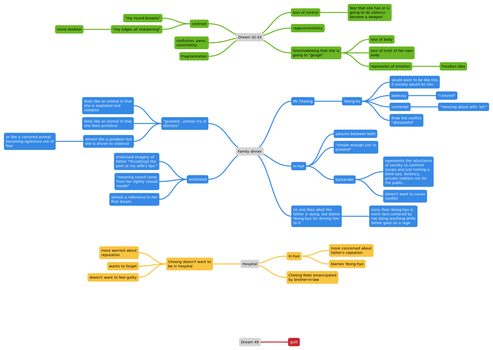
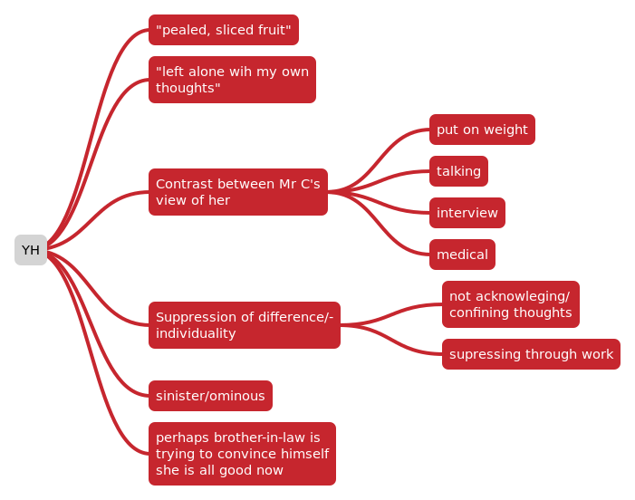
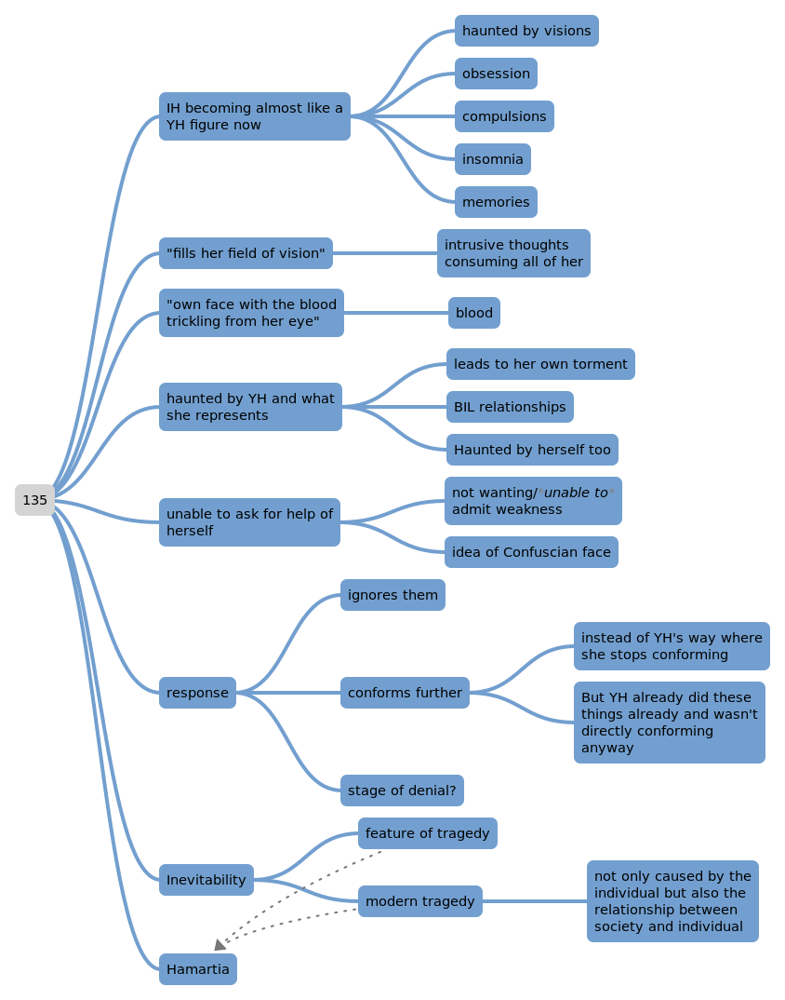
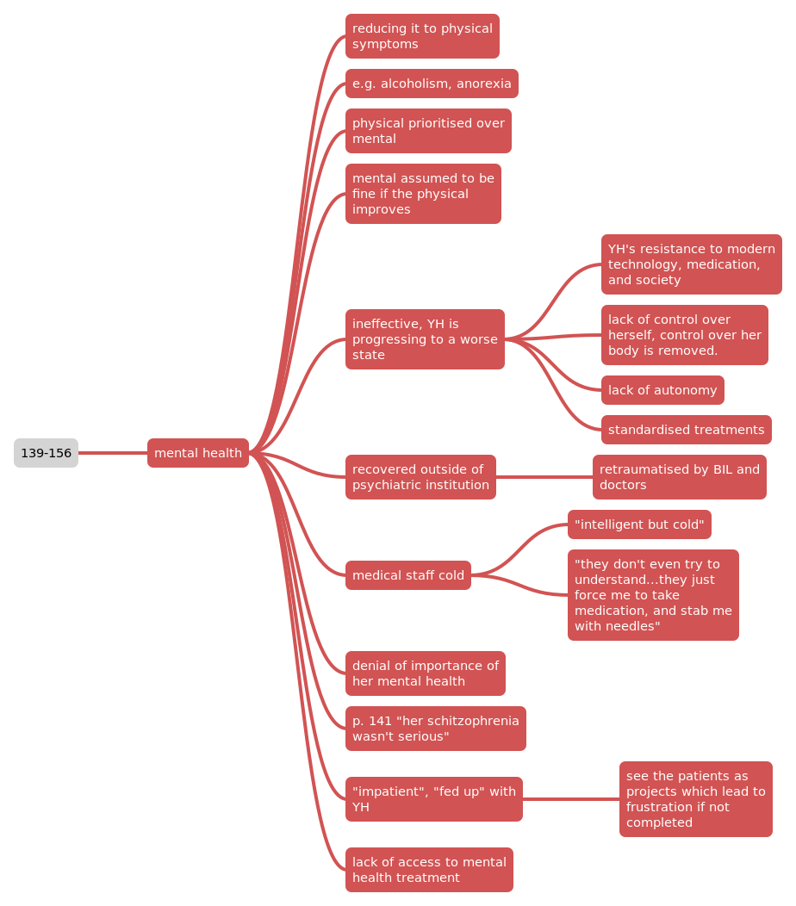
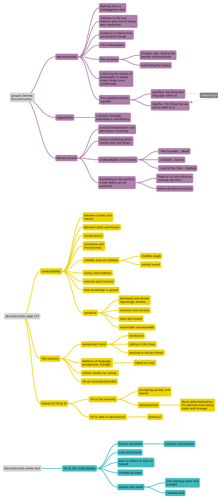

# 001-6
## Opening

- Han prompts us to question Mr Cheong and his way of life by showing unappealing traits.
- We are unsure of the reliability of Mr Cheong due to his involvement and apparent bias in these events
  - Mr Cheong is an ***unreliable narrator***
- Mr Cheong's apathy is concerning
# 006-12
## The first scene with Yeon-hye

# 012-13
## Yeon-hye's first dream

# 030-1
## Yeong-hye's father & rape by husband

# 032-52

- End of Part 1
# 055-60
- Start of Part 2

# 060-65

# 071-75

# 076

# 123-124
Start of Part 3

# 129

# 132

# 135

# 135-x

# 136-7

# 139-156

# 143

# 157-8 and 162

# 163-6

# Derrida

# Oral Presentation

***

## Part I of *The Vegetarian*

### Question:

#### To what extent does Yeong-hye's attempted suicide criticise Korean society and the family unit?

## 2

Taking a Confucian perspective, relationships between people are unequal with defined hierarchical roles. When this natural inequality is respected, it becomes easier to maintain stable relations among individuals and, therefore, in the society as a whole.

Still important in social, familial, and professional environments.

Influence is no longer as extensive in younger generations, as described by an article on South Korean culture by cultural atlas (https://culturalatlas.sbs.com.au/south-korean-culture/south-korean-culture-core-concepts), it still plays a large part in the overall actions of the family as a unit in society and the interactions within it.

In the first part of “The Vegetarian”, this hierarchical structure is evident in Yeong-hye and Mr Cheong’s relationship and their family:

their relationship is based on Mr Cheong’s illusion of mutual respect and wife’s submission and conformity.

Yeong-hye is shown as passive, while Mr Cheong is more active

Yeong-hye’s vegetarianism is seen as a disobedience and overturning of this structure by Mr Cheong and her family.

Her vegetarianism would be seen as undermining Mr Cheong’s authority over his wife (so he makes excuses for her) and an insult to the executive director who is paying for the food which she doesn’t eat.

This is only made worse by her blurred makeup, poor dress combination (she is wearing trainers) and not wearing a bra---seen as inappropriate etiquette and not caring about her appearance or keeping face.

Yeong-hye is seen as unaware or not caring about this social structure when she is described as “staring baldly at my boss’ wife”, which “appalled everyone present” as a sign of defiance against the hierarchical structure which would have her be apologetic towards her superior. this is seen as so outrageous that Mr Cheong wanders it is possible she “hadn’t grasped the status” of who she is staring at. This might reflect not only her dissociative state of mind which is later explored when Mr Cheong rapes her, but also of the younger generations who do not care so much about the Confucian hierarchy or face from their superiors.

It is not the case that she is trying to be rude. her refusal to conform to the normative expectations of Korean society, is not a refusal to conform, it is just a personal choice. this choice is a deviation and nonconforming action, but it is not done for this reason. yet, the structure would have it be so as it is seen as an act of defiance, disturbing the interactions itself almost to self-preserve the structure.

this even suggests that the reason the interactions are more “stable” when accepting them is not because it is naturally so or a great system of social interaction, but rather that it is made so artificially by people who want the structure to be so.

## 3

The events leading up to the suicide of Yeong-hye can be seen as a criticism of the Korean family and tradition. The dreams which Yeong-hye has and her mental decline are ignored by everyone and her declining health seen not as an issue as long as Mr Cheong retains face or is able to be satisfied in his control.
​

Yeong-hye’s refusal to eat meat is seen as a direct defiance of Mr Cheong’s authority by himself and Yeong-hye’s family.

The hierarchical relationships are seen as unbalanced by Yeong-hye’s refusal to eat meat, her apparent agency is not respected by the others and seen not as a personal choice but as a reaction and defiance of Mr Cheong’s choices.

The lead-up and direction towards her attempted suicide in the family dinner is a vignette criticising the family unit of traditional Korean society and it’s modern progression. The father is a dominant, violent man who beats Yeong-hye in front of her husband and force-feeds her. The wife cries and appears to superficially care for her daughter’s health, but only does so so that she is presentable in public and for her husband. The brother and sister do nothing but superficially complain. The husband is eerily passive throughout, as if his intrusion would cost the family face and it is not his place to intervene.

The vignette highlights the highly fragile and violent nature of the tradition family’s remnants, that non-conformity is treated as a hostile, manipulative act, that nothing is actually done other than superficial complaints---perhaps such that one can say “Oh, but I was in disagreement with what was happening” or “Oh, but I did not stop it, it was for the best though it was unpleasant” depending on the circumstances.

There is a habit of passivity and impulsiveness, of coercion disguised as caring and a self-righteousness of knowing what is best.

Perhaps it is the case that it would have been better for Yeong-hye to continue eating meat, or to “draw up a proper, well-balanced meal plan” as In-hye demands. However, the cause of her apparent defiance is never addressed or questioned. No one wants to ask why she is doing this---and if they do Yeong-hye is not allowed to explain or they do not want a reason. They only care about her superficial and apparent health, not her well-being.

This is a broader criticism on the reliance on face that the traditional family-unit has and craves in society. Yeong-hye’s appearance and actions are shameful to the whole family on the broader social scale, so anything must be done to prevent this occurring.

## 4

The attempted suicide itself is not seen as a response to the force feeding and trauma of Yeong-hye, as a response to the build-up of her conditions and experiences. It is not seen as the result of mental illness or instability either. It is seen as a further act of defiance by her family.

This further criticises the society of face, the blame is not on the family but on Yeong-hye’s personal responsibility.

The family structure cannot bear to admit any fault, because the system is supposed to be harmonious. Obviously, this is why everything went wrong: Yeong-hye’s defiance and usurping of the hierarchy led to the unstable relationships and family structure, made even worse by her actions. If only she had done as she was told, nothing would have happened.

Of course, this is absurd. It was not a disturbance of the harmonious structure which led to Yeong-hye attempting suicide. It was the reaction of the people within this structure. The reluctance to progress or accept Yeong-hye’s choices or to actually care about her health and well-being, instead focusing on preserving the family’s face because the Confucian family unit must maintain it, leads to the ridiculous actions by her family.

The structure must be seen as working, therefore it is artificially made to work by people within it. The toxicity of the traditional social values and carried on structure makes it so that individuals and units must conform and not lose face.

## 5

Even Yeong-ho’s wife admits that her father-in-law “went too far” to beat Yeong-hye, *in front of her husband. This criticism is not of the beating, it is about how it was public.

Everyone at the scene lost face because they were present or vicariously experiencing the others’ loss of face.

Mr Cheong decides to tell Yeong-hye it is better to consider the whole series of events as just a “bad dream” and forget about them, moving on. The refusal to acknowledge anything is wrong and wish to keep everything behind closed doors reflects the toxic social pressure to not lose face. Mr Cheong also wants to move on quickly and allow himself to be absolved of any blame by pretending none of this ever happened.

In-hye blames Yeong-hye because she doesn’t say anything to her father, which “was bound to make him upset”. The use of the word “upset” undermines his violence and excuses his actions almost as that of an angry toddler or someone who is sad and crying instead of the violence which the father expressed.

The continuing attempts to force Yeong-hye to eat meat reflects on the persistent attitude of the social structure and traditional hierarchy.

If we interpret Yeong-hye’s apathy to the social norms as the younger generation’s lack of care for face by their superiors in the Confucian ladder, then Yeong-hye’s attempted suicide is the response to the pressure by their peers or the inability to continue doing so, and the aftermath is the wish to forget about the ugliness which takes place and keep it in private rather than the public.
# The Vegetarian: Ending
homework task, firefly questions
## Imagery:
> What could In-hye's visions on p. 169 represent? Give reasons for your answer.

The power of nature over humanity: "lines of rain drill into YH's body like spears"
The reliance of human society on nature as a foundation: the cities and things representing society are "floating...on the roof of the forest"
The human idea of society and humans higher than nature as they are like "above" nature, yet reliant on it like "islands".
The insignificance of human achievement: "only fragments" of human society being "swept away somewhere" yet in a "heartless sea". Nature does not care for it.

## Language:
> What is the effect of the repeated questioning on p. 170?

A mimetic device to emulate IH's thoughts and replicate in the reader the disbelief and wonder in her. The repeated questioning quickly emits a sense of disbelief and almost sarcasm, yet its consistency retains in it genuine wonder.
The constant questioning by IH is a repeated theme across part 3. While it typically serves to illustrate IH's hamartia of over-responsibility and blame, in this instance it changes the tone: from one of worry about the questions having to exist at all and a solution to prevent more questions, to  one of wanting to answer the question themselves.

## Structure:
> What is the effect of Han Kang beginning so many paragraphs in the end of the book with the phrase, "Time passes." Explain two effects that you think this repetition has.

1. anaphoric repetition of  "Time passes" quickly becomes repetitive and slightly dull. This is mimetic of the dullness IH experiences in her life, everything begins to feel the same as if there is no reference of time as a metric absolute or topological relation, only as a passage of it. This further reflects her psychological state of dissociation similar to YH's in withdrawing into herself but maintaining the uniqueness and difference between the two sisters. Han therefore creates in the reader a sense of the state IH is in that everything fades into a single passage of amorphous time.

2. To establish a difference between narration, further distancing the characters and revealing an insight into their thought process. In part 1, Mr Cheong keeps the time metrically, showing his place in capitalistic society of ordered efficiency and value-assignment to everything from people to time itself, and his view of how things are relational to an ideal of absolute time; neither relational, unique, nor amorphous. In part 2, BIL keeps the time relational to other events, we do not have such an ordered sense as with Mr C, but there is a sense of artistic value in the individual moments and how they are all related to each other --not to an absolute ideal. This reveals BIL's attempted rejection of the episteme of thought towards social ordering through time: he does not view everything as value assigned to some material ideal, but rather relational and individual yet still material and assigned value this way. This shows the psychological and social failure of the BIL. In part 3, time is amorphous. This could be seen as almost the typical romanticism of insanity or madness, which IH appears to be going towards in her declining mental health, yet still managing somewhat to not completely enter such as YH has. This is characterised by her successful rejection of time as a marker for events, there is no time between events other than "time passes": it does not matter what has happened when, 
only that it has; even this is challenged. point 1 serves to further this point as a counterbalance to the possible romanticised version of poor mental health which could be drawn, we see that the balance IH strikes leaves her unfeeling and dramatically dissociated. This shows how it is not the utopian break from hegemony and capitalistic episteme but an apathy to life which leaves IH bad enough to later consider hanging herself without much outwards perceived distress properly processed. Therefore, this establishes a different in narration and perspective in thought process.

## Structure:
> In what ways is the force feeding of Yeong-hye (p. 173-6) reminiscent of earlier scenes in the novel? Give at least two examples and explain the significance of Han referring back to them now.

1. before, IH tries to feed YH fruits she previously wanted; before, mother tries to feed her meat she previously enjoyed. They also both try to tempt her by placing them in her hands, or near her lips or nose.

2. doctor uses a tranquiliser, feeding tube, and asks assistants to hold YH still;  father slaps YH's mouth open, uses fingers to force-feed her, and asks family members to hold her down.

3. Both times the force-feeders believe they are doing their "duty": to "preserve life" or social respect/health of their daughter.

This comparison links the reader's thoughts to the previous episode of force-feeding, which is intentionally described to be horrific and wrong. The second time, it is arguably more gruesome yet packaged as a medical procedure and so justified. Han challenges this through the comparison, to show how force-feeding is always distressing and, perhaps, wrong. Also to challenge the view that society knows what is best for the individual, both times they do not accept the new situation and cling on to the past (feeding meat because before YH ate meat, feeding fruit and then gruel because before she did). This social commentary therefore serves as a criticism of social power over the individual, and of the double standards held over authority and righteousness. The standardised treatment's failure such that this emergency procedure needed to take place compares to the previous failure of the family to support YH, drawing a parallel of how individual and social failure to support others leads to catastrophic disasters, regardless of how they are presented--as the individual's fault, or as inevitable.

## Themes:
> "It's your body, you can treat it however you please." (p. 177)
> To what extent do you see this philosophy supported in 'The Vegetarian'?

Highly so. Although the argument could be made that the physical state of YH--and perhaps mental state too--contradicts this, i find this to be incorrect.

Han criticises the failure of society as a whole and the individuals within it to adapt to and accommodate for individuality and bodily sovereignty. In every case, it is always the doctors or family presented as failing YH, not YH failing herself. On a whole, it is the society failing individuals in the entire novel which drives the plot and suffering within it. Both sisters are failed by society, and to an extent so are Mr C and the BIL.

However, the BIL and Mr C are not presented as complete victims of social failure. They chose to take advantage over other bodies, removing this autonomy over the self in doing so through YH's marital rape by Mr C and rape by BIL, as well as neglect of IH and the jealousy of both husbands for the other wife. Thry are presented as victims of society in some ways, but also aggressors.

Therefore, the idea that "your body, you can treat it however you please" is thoroughly supported throughout the novel. It is not that one should be refused sovereignty over the self and body to avoid the disasters of The Vegetarian, but that society and individuals respect and support this autonomy.

## Themes:
> "He is a sensitive child, prone to minor illnesses, but he is also a happy child. How will she make sure he stays this way?" (p. 179)
> Does 'The Vegetarian' provide an answer to this question?
> Think about who or what Ji-woo could represent and the significance of his own dream on p.180.
> Think too about if there is any way to avoid the fate of Yeong-hye and In-hye or if it is presented as inevitable.

The Vegetarian presents the fatal flaws of the characters as inevitable given the social structure, and caused by it.

The Vegetarian suggests that a continuation of the hierarchical and unmoving social structure will leave no true hope for Ji-woo's happiness. However, it suggests that on an individual level it is possible to retain happiness, or some version of it, despite the social standard. As evidenced by IH's almost salvation by the mere existence of Ji-woo and the responsibility she feels for him, The Vegetarian provides a solution. By individual change and connection it is possible to maintain a happy life, and perhaps in the process change the structures themselves. Although this salvation is really IH giving in to her hamartia of over responsibility, it serves also to save her. Therefore The Vegetarian presents that these flaws in characters and therefore individuals are only flaws by how they are handled by others and built in society.

Ji-woo therefore represents the future generation and the hopelessness hope of change, the change which occurs is the social structure repeating itself. Yet through this there is still the possibility for genuine change and happiness.
Character:
"I have dreams too...and I could let myself dissolve into them, let them take me over...but surely the dream isn't all there is? We have to wake up at some point, don't we?" (p. 182)
To what extent do you think this summarises the differences between the two sisters? Why?
YH has become lost inside her dreams away from reality, while IH has become lost in reality away from dreams. Yet in an oxymoronic way, YH is more in reality than IH.

YH has been able to make her reality be her dream, while IH fails to make reality real or her dreams false by her rejection of them, her inability to break free from social "bars" of the "jail" she finds herself in.

The apparent realism of IH, "we have to wake up at some point, don't we?", contrasts her dissociation and hopelessness in life. YH is able to stop eating meat and become more plant-like, though only in her mind, and IH is unable to stop her dreams or even act in the ways she wants to. This makes YH more real in a way than IH through YH's ability to self-determine.

# To what extent does Han Kang create sympathy for the brother-in-law in The Vegetarian? 
## context: only under half of part 2 read
 

By disclosing his negative traits which initially push the reader away, Han Kang simultaneously creates a sense of sympathy and distaste for the brother-in-law. The initial mirage of the perfect family unit and freedom of the brother-in law is shattered at the beginning of the second part of The Vegetarian, “Mongolian Mark”, to emphasise the key theme of misunderstanding: the sympathy created for the brother-in law and forced upon the reader is one of pity and realisation of the nuance of characters and the misunderstanding of them and within them. While his attitude and forcing of this sympathy is meant to make the readers dislike the brother-in law as the narrator, the sympathy which Han Kang creates juxtaposes his negative aspects to create a more shocking image of the human condition of misunderstanding. 

At first, one might argue that this is not the case; Han Kang does not create sympathy for the brother-in-law. The sharp juxtaposition of Mr Cheong’s description of the brother-in law and the brother-in law’s narration is clear authorial intent to undermine the reader’s previous understanding to the effect of not sympathising and view the brother-in law as almost deceptive in his own portrayal. His obsession with the Mongolian Mark as a symbol for innocence and childhood, something now inaccessible to the brother-in law as an adult in society, and his urge to free himself from a privileged life which he finds dull and boring is a direct example of how Han Kang attempts to undermine any sympathy for the brother-in law: we are not to sympathise with him for being in a difficult position but to see him as a man with a self-deprecating yet self-righteous position. His desire for more—to be more “pleased” than his wife makes him but no longer does, to possess what his “new wife was missing”, and the use of the free indirect discourse to show the mindset of wanting to have things and be more than others by the lexical choice of “lacking”, “missing”, “whose goodness is oppressive” and “nothing else would do as a substitute”—and obsession over the constructed “image” of Yeong-hye which he has no need to justify or critically examine because it is “so clear” yet “ beyond comprehension”, giving him an excuse for his perverse obsession through almost an artistic license to not have to explain himself or hold himself responsible because he finds this image “beautiful” and like a piece of art which has puts him “though this anxiety”. This is meant to undermine any sympathy for the brother-in law because of his views on others as ornamental items to decorate his life with, and as a person who uses his status as an artist to excuse his actions and thoughts. Kang’s use of narration then is a clear case of removing sympathy for the brother-in-law by portraying him as a man with a complex of victimhood and self-righteous suffering as an excuse for irresponsibility and exculpation. The free indirect has the effect of portraying the character and narrator’s opinions as unadulterated and objective fact; the brother-in law’s opinions are not. It is as if he is telling his own story and thoughts to someone else, his intent to portray himself as a victim fails purposefully for Kang to allow a deeper insight into the character’s psyche. The retelling of him getting “an erection…almost the first time since his marriage” with an “intense sexual desire…focused on a clear object” and the conclusion that it is him “attempting to throttle” and “thrusting himself into” Yeong-hye is a clear example of this. The perspective of him being above others and owning or possessing them as objects is clear in this startling image similar to the marital rape of Yeong-hye by Mr Cheong in the first part of The Vegetarian. While it might appear to make him “grimace” out of distaste at himself for feeling this way, it is clear that we are not meant to sympathise with him for this as he is later described as masturbating to Yeong-hye directly after the display of violence of her attempted suicide: the brother-in law finds almost a guilty pleasure but denies this in favour of the appearance of ascetic suffering and resignation, something which Kang intends to make the reader dislike and not sympathise with. 

Although this distaste at the brother-in law is true, it is not the case that it attempts to make the reader not sympathise with him. Kang creates both a distaste for the brother-in law and a sympathy towards a man who is trapped in society and failing in his insecurities. Kang intends for the reader to understand his situation and sympathise with the brother-in-law’s misunderstanding. The juxtaposition of Mr Cheong and the brother-in law’s perspectives are perhaps also to further the theme of misunderstanding and almost social typesetting, as well as explore the mental health and society of suffering in silence to build sympathy towards the brother-in law. His obsession with the Mongolian Mark and Yeong-hye is disturbing and an unhealthy release of his emotional misunderstanding caused in part by his dry marriage and stored self-hate, in this way Kang attempts to create sympathy by writing the brother-in law to realise this guilty pleasure and unhealthy release as what it actually is, but feels powerless to stop it. The questioning of if he is “a moral human being?” and consistent modality of doubt and anxiousness throughout builds a sense of sympathy for this man trapped in a society in which he is misunderstood and misunderstands others. This is evident in how he forces his self-hate onto his wife by describing her as “making an effort to not sound too put out” and as “demanding”, with the emphasis on the constant questions by In-hye as a signifier for his insecurities in how he sees others as also doubting and hating himself for his thoughts and miserable state of mind. The graphic description of wanting to “pummel his cheeks until the blood showed” and “smash his ugly lips, swollen with desire, with the sole of his show” as almost a punishment for the intrusive thoughts and urges which he does not want to have—and especially not enjoy, even though he does—and the violence of his imagination when thinking of having sex with Yeong-hye, along with the arousal at her blood staining his clothes, echoes to the dreams which Yeong-hye has. In this way, Kang builds some sympathy for the brother-in law by associating his obsession and urges with the dreams which distress Yeong-hye so much to hint at the suffering which he feels himself going through. The reader is also meant to view his dehumanising and objectifying outlook of others as a struggle for the brother-in law in itself, it goes against his passionate nature as the artist he views himself (unlike Mr Cheong) and makes the reader consider the brother-in law as a product of society and limited by society. His attraction to Yeong-hye as someone different, able to defy society and her innocence towards it, therefore is both a source of worry and disgust for the reader but also pity and sympathy: the brother-in law’s obsession is an unhealthy way for him to want to be free cathartically through her and to overcome his insecurities which he feels by his perfect opinion of In-hye. However, this may also prove to be false just as Mr Cheong’s view of the brother-in law was as she is described as constantly “exhausted” and perhaps lonely, further tying into the theme of misunderstanding. His silent suffering and hate of himself, exhibited by him struggling to accept he is the “middle aged man” in the window, another perfect example of misunderstanding himself and the social commentary on the danger of silent, solitary suffering by the projection of these feelings towards himself onto how he perceives others to see him, and how his urges manifest themselves in violence and obsession 

To conclude, Kang builds a consistent sense of sympathetic pity and understanding of the brother-in law while maintaining a sense of disturbance and dislike towards him. The constant sense of being misunderstood by others and society and limited by this expectation as well as participating in it by misunderstanding himself and others—the most obvious example being his romanticism of Yeong-hye and misunderstanding her as a person, and perhaps also In-hye by projecting himself onto her—and more importantly for sympathy, himself. The reader is lulled into a simultaneity between a distaste for the thoughts and views of the brother-in law but also a pity towards his condition in society and others. Many of the things which appear to diminish the sympathy towards him therefore increase it; we pity the brother-in law and sympathise with his guilt at pleasure and hate for this as a result of unhappiness.  

 
 
