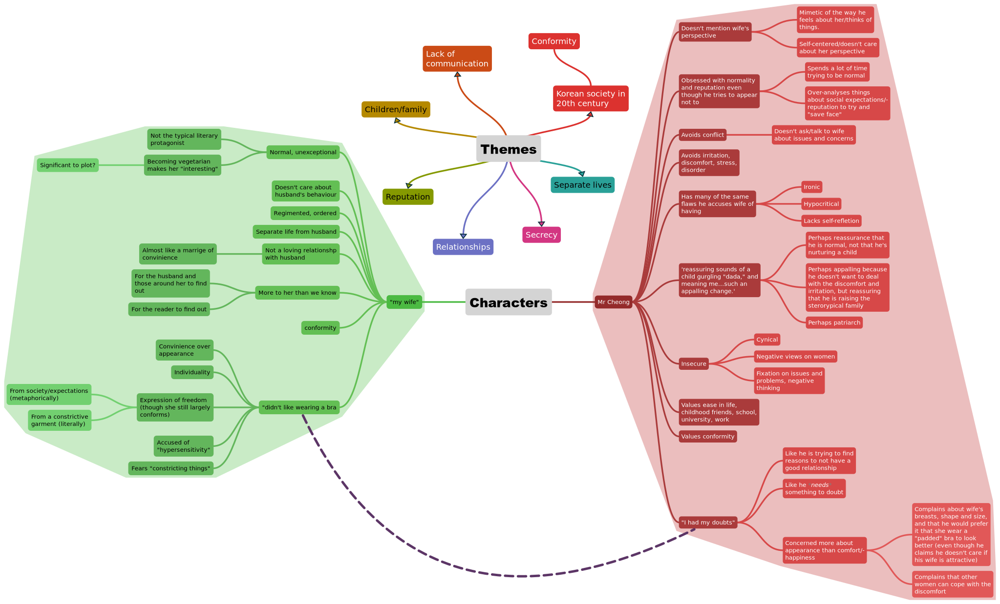

# 001-6
## Opening

- Kang prompts us to question Mr Cheong and his way of life by showing unappealing traits.
- We are unsure of the reliability of Mr Cheong due to his involvement and apparent bias in these events
  - Mr Cheong is an ***unreliable narrator***
- Mr Cheong's apathy is concerning
