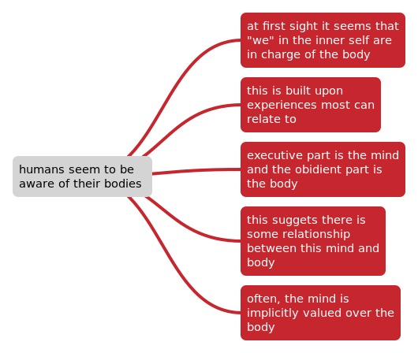
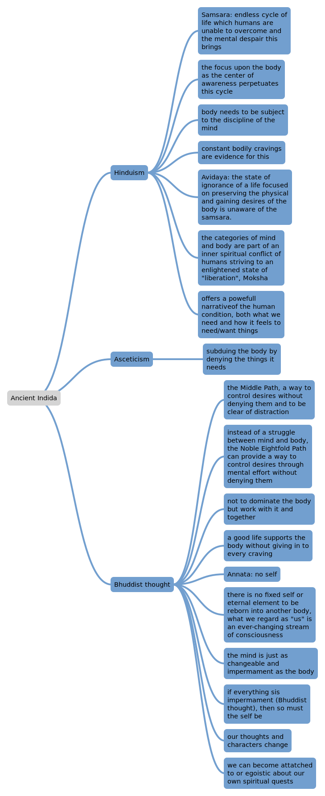
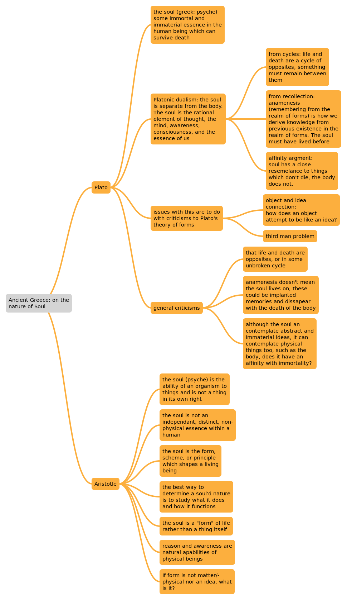
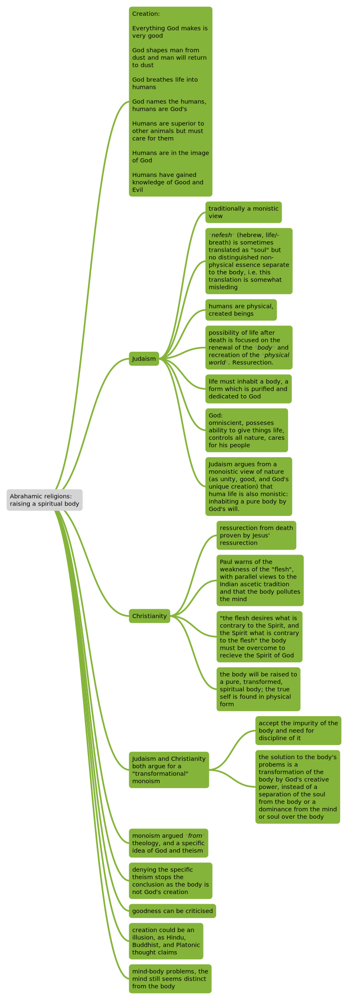
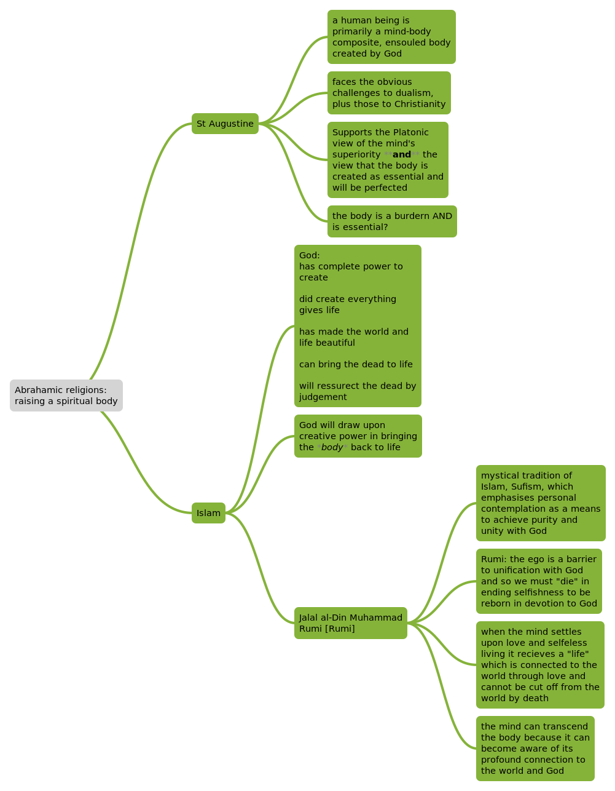

# 02 Ancient views of Mind and Body

## Notes

|                         | Plato                                                        | Aristotle                                                    |
| ----------------------: | :----------------------------------------------------------- | :----------------------------------------------------------- |
|         main  M/B work: | Phaedo                                                       | On the Soul                                                  |
|      Literary approach: | dialogue                                                     | treatise                                                     |
| Philosophical approach: | rational/abstract                                            | rational/empirical                                           |
|           Key argument: | dualism: soul is the abstracct and eternal, it is immortal and non-physical | monoism: soul is not a thing itsseld, it’s the form which makes the physical body alive, a unity |
|              Criticism: | proof from cycles is doubious, issues with theory of forms   | no explanation of where this “form” of the body comes from   |

## paragraphs

### "Ancient views of body and mind are outdated"

#### For

Relies on ancient worldviews and understandings of reality which may be different to today. A clear link to Foucault’s idea of the episteme can be found here: these ancient vies on the body and mind originated and developed in entirely different episteme, both in culturally and time-scale wise. Any relevance they may have today is in the context of the current episteme they are studied or accepted in, not in the original. Therefore, while one could make the argument for the ideas, they are not the *ancient* ideas, but the current understanding of ancient ideas; they are essentially not the ancient views if they are relevant, but the current views: the “true” ancient views are beyond the episteme and outdated. Furthermore, in the current scientific paradigm and social obsession with data verifiable or falsifiable through a scientific method, it could be argued that the views are outdated in society due to scientific progress in understanding of the world; those who hold that it is not the role of philosophy to describe the world, such as the logical positivists or broader social paradigm of scientific method, find these views as outdated as they cannot be empirically investigated or proven. Furthermore, the specific jargon is part of a language game unfamiliar to—and perhaps incompatible with—most of contemporary society. It is not simply that the *ancient* views are no longer the currently held interpretations of them, or that they are outside the broader empirical scientific paradigm’s scope and so delegated as “outdated”, but that even the language of them is outdated and incompatible with contemporary society. Furthermore, many of the religious views provide a form of narrative or meta-narrative, which postmodernism rejects.

#### Against

While it could be argued that the ancient views are no longer the same views held now, so it is true that the original sense of the views are outdated, it is not often the case that these are the views discussed. The natural progression in though various epistemes must be considered as part of the ancient view and as a whole: while it may be true that the original sense is outdated, when one talks of the “ancient views” it is not the original but the whole interpretation of and progression of ideas relating to them. Therefore, it is still the case that the current views on the ancient ideas are the ancient views themselves—it is different to talk  of the ancient views and the original understanding of the ancient views. As the progression of ideas is included, it is possible to reconcile some of the views with the current episteme and build upon them in new thought and interpretation. The providing of a narrative can also be helpful to some, one could hold that the ancient views of mind and body provide a symbolic system of meaning which is applicable today. The postmodern rejection of meta-narrative can be opposed too, it is not mandatory to conform to the current underlying system of thought. Furthermore, one can hold certain parts of the views separately from the meta narratives. Additionally, if one considers them outdated by virtue of contradicting the current paradigm, then it is not a criticism of the views. The idea that we have shifted past the ancient paradigm is perhaps misleading, previous ideas can still be useful and relevant, and conforming to the paradigm is contrary to the idea of how paradigms ought to proceed for progress.
