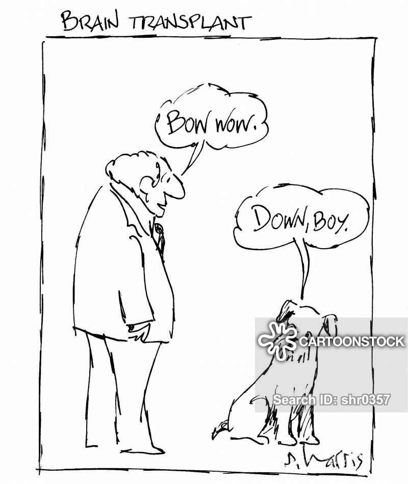

# 03 Humans as minds
Rationalism

## Textbook notes

### The scholastics

- Human knowledge primarily derived from the senses (Aristotle)
- Scripture is an infallible source of knowledge, given by God
- Mind interprets evidence from senses and scripture
- Therefore, humans are created in the body (as scripture describes)
- Therefore, physical form of humans is created by God and can be understood through senses
- However, the soul is immortal (Plato) because the intellect is immaterial/non-physical
- Therefore, human is created as a body+soul/intellect composite: the soul will survive after death and the soul will receive a renewed body after resurrection (Augustine)

Part of a Medieval worldview where there were two revelations: the scripture and the natural world. Mind/Body problem was dormant as the reality of nature as it appears was taken as a given thing. There was no reason to doubt the senses, the intellect or nature, because they were God-given. There would be no reason for God to deceive us, so we are a mind+body composite because we seem to be.

### Ficino

- Develops his arguments in *Platonic Theology: On the Immortality of the Soul* (1474).
- Ficino has a strong agenda of uniting Platonic thought with God

Ideas are the most real things and it is the goal of the mind to uncover them

The mind has an affinity to the non-physical and abstract.

The soul has a desire towards immortality. All humans have a hope to live and be spiritually united after death.

This desire is either true or a false hope. It cannot be a false hope because nature is characterised by the goodness of God and God wouldn’t give a universal illusion.

Therefore human desire for immortality is realistic and the rational soul is immortal. 

Reason and the soul become more effective when isolated from the body: when we experience lots of physical sensations it is difficult to think. Clearing the mind is clearing the physical.

> Then the soul despises corporeals and when the senses have been allayed and the clouds of phantasmata dissipated…then the intellct discerns truly and is at its beightest

| Plato (*Phaedo*)       | Marsillo Ficino (*Platonic Theology*) |
| ---------------------- | ------------------------------------- |
| Argument from cycles   | Accepts Platonic arguments, *adds*:   |
| Argument from ideas    | Argument from desire, benevolent God  |
| Argument from affinity | Argument from isolation               |

### Descartes

- Foundationalism: attempts to rebuild knowledge from the bottom up using fundamental principles
- Radical doubt: he wishes to question *everything*

The possibility that our senses can be deceived.

Evil Demon thought experiment

> Thinking is another attribute of the soul; and here I discover what properly belongs to myself. This alone is inseparable from me. I am—I exist: this is certain…I am…only a thinking thing, that is, a mind

- Human beings *are* minds, they are thinking things
- Whatever the body is can be distinguished from the essential core

Mind and body are distinct substances.

- Has immediate logical certainty in the existence of his mind, but not of the body
- Body is characterised by extension (size, etc.), the mind is not
- The possibility of reasoning from the mind to the physical body: it is apparent there is a physical body and external world from the senses, though they can be doubted

God’s existence is certain. God is perfect, so would not deceive. As sight comes from God, the mind can put its trust in the body’s existence.

Interactionism: the mind and body interact.

- Fundamental problem of how this works

Descartes tries to use the pineal gland; this isn’t a very popular theory.

- Does interactionism pose a double standard? It seems to separate the mind and body but links the mind and body

> How can Casper *both* glide through walls and grab a falling towel? How can the mind *both* elude all physical measurements and control the body?

​	—Dennet, *Consciousness Explained* (1991)

Ryle, *The Concept of Mind* (1949)

- “ghost in the machine”

- Category mistake: Descartes fundamentally misunderstands the category which the mind belongs to. The mind is simply the a collection of abilities and actions directed through the brain and central nervous system; the *res cogitans* is not an object in its own right, or a distinct substance
  - Example of a visitor going to Oxford (where Ryle taught philosophy), seeing all the buildings, colleges, faculties, etc., and asking “where is the university”. It is a mistake because the visitor has placed the university within the category of a physical spaces in that it must be in one particular place; the university is belongs in a broader category of the people, buildings, faculties, projects, etc., which make it up. Just like the mind.

### Philosophical terms

| Term                            | Definition                                                   |
| ------------------------------- | ------------------------------------------------------------ |
| Cartesian                       | Of or towards the philosophy of Descartes: Cartesian doubt, Cartesian dualism, Cartesianism, etc. |
| Category mistake                | Semantic or ontological error where things are presented as if belonging to a different category than they are, or having a property it couldn’t possibly have. Used by Ryle to criticise interactionism |
| Descartes’ demon                | Thought experiment of the evil demon who distorts and misleads, supporting the idea of radical doubt that any belief could be false |
| Foundationalism                 | Philosophical project of building up knowledge from truly basic and certain knowledge |
| Ghost in the machine            | Phrase coined by Ryle to criticise interactionism            |
| Interactionism                  | Proposal that the mind and body are distinct, but must and do interact in some way (e.g. the mind directing the body) |
| Radical doubt                   | The process of doubting all beliefs, radical scepticism, to clear away all uncertain opinions |
| *Res cogitans* (Thinking thing) | Descartes’ definition of the mind of a human being as primarily a thinking substance |

### Problems which may arise from Descartes’ radical doubt

Most criticisms of Descartes focus on his speculations about the non-physical mind substance.

We can chose to doubt pretty much anything, but is it reasonable to consider *everything* as more doubtful than the existence of our own thoughts?

Foucault offers criticisms of the *cogito*‘s strength by the shift from Classical episteme to the Modern episteme (pre-kant where thought is representation –> after Kant). 

Radical doubt may also present these problems:

#### Solipsism

“I am the only existing mind”

How can I know whether anything outside my own consciousness is real? Am I the only mind? 

- Descartes thinks he solves this by proving the existence of God

#### Problem of other minds

“How do I prove there are other conscious minds?”

Perhaps link to philosophical zombies?

## Stimulus task

The stimulus shows a cartoon titled “brain transplant” and shows what appears to be a human and a dog, but the roles they are playing are reversed: the human is barking and the dog is telling him, “down, boy”. The suggestion is that it is possible to separate the thinking part of a human from the body by transplanting the brain, and that what makes us human is this thinking part. This could suggest that what makes us human is purely physical, or that the mind is housed in and interacts with the physical through the brain in a Cartesian way. I will explore the possibilities of the physicalist and Cartesian dualist’s applications to the comic, and how the way the mind and body interact determine what it is to be human. This is an important question as the understanding of how humans are built could inform the speculation of life after death and determine philosophical ways of life such as an existentialist or deterministic view of what life is.

