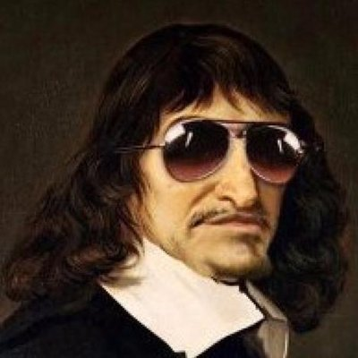

# 06 Meditation 1

**What can be called into doubt?**
Inside Meditation 1 we find the following 5 arguments:

- Sensory Doubt (p15-16 + p75-79)
- The Dream Argument (p16-17)
- The Painter’s Analogy  (p79-81)
- The Deceiving God Hypothesis (p17-18)
- The Defective Origins Hypothesis (p18)

Individually, these arguments query certain parts of our knowledge.
Together, they are Descartes’ first attempt to understand what can be truly said to be known/knowable.

## Sensory Doubt

### Summary of the Argument:

1. There are some things you believe as true you later find out as being false
2. These falsehoods are used to construct a large part of some knowledge
3. The knowledge is then doubtful, we need to deconstruct them and begin again
4. The senses we base knowledge on are often deceived
5. We shouldn't completely trust things which sometimes deceive us
6. We cannot completely trust the senses
7. There are some things which only the mad can doubt
8. Adopting the mad as a basis for knowledge is unproductive

### Three Key Quotes:

“Whatever I have up till now accepted as most true I have acquired either from the senses or through the senses”

“There may be other beliefs which are derived from the senses about which doubt is quite impossible”

### Purpose of this argument (in the wider context of Meditation 1)

The senses cannot be trusted to give certain knowledge

Establish a reason to argue that there is a need to doubt the senses.
Establish a reason to continue to doubt things not based on evident truths
To allow Descartes to suggest that there are some things we can be certain or uncertain about to establish certain evident truths

## The Dream Argument and The Painter’s Analogy

### Summary of the Arguments:

1. We have similar experiences as the mad when we dream, and believe them to be true as they happen
2. There appear to be no signs as to being awake or asleep
3. Suppose I am dreaming, then the things we thought were certain about ourselves are not
5. But the things making these illusions are real colours and made up of combinations of things we have seen
6. There appear to be some things which must be real, the things making up the false illusions at least
7. A conclusion to draw might be that astronomy, medicine, and others which depend on things making them up are false. While the fundamental studies of more general things, e.g. geometry, maths, which deal with the simplest things are certain whether they exist in reality or not

### Three Key Quotes:

“As I think about this more carefully, I see plainly that there are never any sure signs by means of which being awake can be distinguished from being asleep.”
“For whether I am awake or asleep, two and three added together are five, and a square has no more than four sides. It seems impossible that such transparent truths should incur any suspicion of being false.”

### Purpose of these arguments (in the wider context of Meditation 1)
I cannot know for certain if experiencing reality or not, however there must be a source of my knowledge somewhere if it is true.
Although I cannot know for certain if I am experiencing reality, the experience must be made of some real things. The painter does not create *ex nihilo*.
They might have reason to doubt the reality of the painting but not that 2+3=5, and not that the real/non-real painting is made of *something*.

To establish that there are certain truths which cannot be doubted
To establish that the most simple things making up the others cannot be doubted, though the larger studies can
To provide a reason for the belief in certain essential truths

## The Deceiving God Hypothesis
### Summary of the Argument:

1. how do I know that god is not deceiving me and there is no shape, size, place, etc. at which things appear
2. How do I know this is not the case, and I am simply deceived to believe these things exist as they appear now?

Not saying there is no God or a deceiving demon, posing a hypothetical of what follows from the meditation.

### Two Key Quotes:

“there is no sky, no extended thing, no size...while at the same time ensuring that all these things appear to me to exist”
“how do I know that God has not brought it about that I too go wrong every time I add two and three or count the sides of a square”
“If it were inconsistent with his goodness to have created me that I am deceived all the time...to allow me to be deceived even occasionally”

### Purpose of this argument (in the wider context of Meditation 1)
I cannot know that God is not deceiving me, for those who claim God gives them knowledge.
Demonstrating to the theist why they cannot hold God as proof of knowledge.
Those things claimed to be fundamental to make up the dream could be false.

A hypothesis: 

To continue on his project of doubting everything he can
To address the issue of perhaps being deceived to believe these fundamental things exist outside deception

## The Defective Origins Hypothesis
### Summary of the Argument:

1. Perhaps I have been made so I make the same mistake every time
2. The origins of ourselves are unknown
3. Perhaps we are made to be defective

### Two Key Quotes:
"the less powerful they make my original cause, the more likely it is that I am so imperfect as to be deceived all the time."
### Purpose of this argument (in the wider context of Meditation 1)
I cannot even know the origins of myself and my nature, the origin for the atheist is an imperfect being, the basis for knowledge for the atheist is even less than the theist

Continue the doubt.
The proposition that perhaps we are defective
That we cannot be certain of our own origins

## Overall argument of Meditation 1
"I have no answer to these arguments, but am finally compelled to admit that there is not one of my former beliefs about which a doubt may not properly be raised"

| Step       | Argument                                                     |
| ---------- | ------------------------------------------------------------ |
| Premise 1  | The senses cannot be trusted to give certain knowledge       |
| Premise 2  | I cannot know for certain if experiencing reality or not, however there must be a source of my knowledge somewhere. |
| Premise 3  | I cannot know that God is not deceiving me, for those who claim God gives them knowledge. |
| Premise 4  | I cannot even know the origins of myself and my nature, the origin for the atheist is an imperfect being, the basis for knowledge for the atheist is even less than the theist. |
|Premise 5| From 4 and 5, I cannot even know that these fundamental things exist based on sense perception|
| Conclusion | I cannot rely on my experiences of the world for knowledge   |

