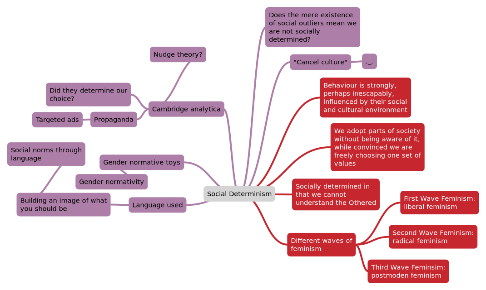

# 13 Social Determinism

Edward Colston (participated in slavery) v. John Wesley (opposed slavery)

>  “Colston was a product of his time”

Marx: we are socially and economically determined but we can change this.
