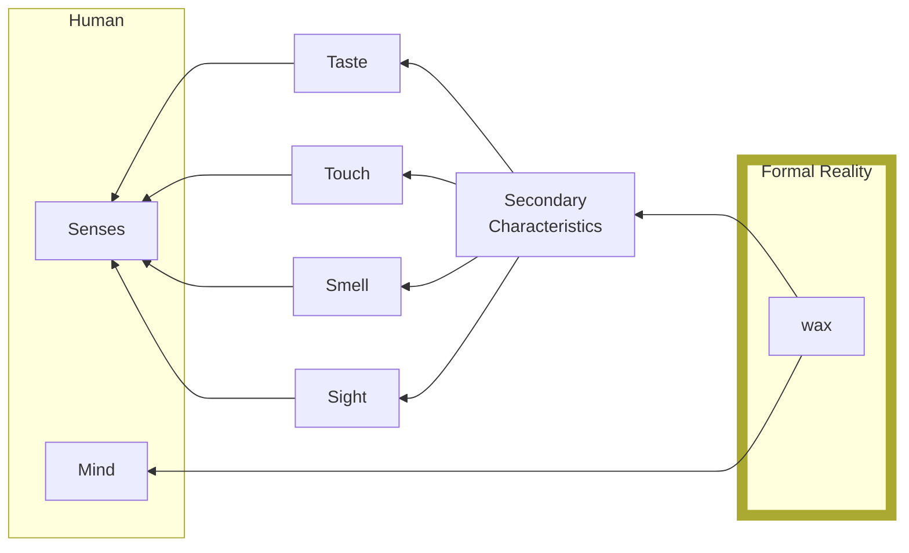

# 21 Meditation 2: The Wax Argument

Descartes' argument
1. All the properties our senses perceive in the wax change when the wax is melted
2. So nothing that we sense is the same form when solid as when it is liquid
3. So it cannot be our senses which make us suppose it is the same

From what can I know that it is still the wax?

- Option 1 Imagination: Imagination is experience changed, it cannot give real knowledge ***
- Intellect + Judgement: A choice, “does this idea accurately reflect reality?”
  - Intellect is a Passive Vessel that receives sense-perceptions and ideas. Where they sit.
  - Judgement is the Will applied.

Sense perception does not give any truth of what the wax is.

- Sense perception =/=  Truth about reality

Substance theory

M2:

> Let us consider it attentively, and setting aside everything that does not belong to the wax, let us see what remains. Indeed nothing remains except something **extended**…

Extension

- Something exists in formal reality

| Representational reality                                     | Formal reality                                               |
| ------------------------------------------------------------ | ------------------------------------------------------------ |
| Reality as you perceive it, your perception of the world. Secondary qualities | Actual reality, the thing as it actually is (formally). Primary quality. |
| Secondary qualities                                          | Primary qualities                                            |
|                                                              |                                                              |

| Secondary qualities                                          | Primary quality                                              |
| ------------------------------------------------------------ | ------------------------------------------------------------ |
| Qualities which are really sense perceptions within us. Things we perceive as a result of interaction with the primary quality. | Qualities that something has independent of sense perception. Extension. What allows secondary qualities. |

Back to the wax.

secondary qualities –> intellect <– Will –> Judgement –> Primary quality —> secondary qualities

Box around primary quality. Dotted line between judgement & Pq, and between Pq & Sq. (inside is formal reality)

Inside Formal Reality, truth lies. If you can know what is inside formal reality, you can know what is right and wrong. This is very hard, until meditation 6.

Box around intellect, will and judgement. This box is the mind.

Between judgement and Pq, a question: to what extent is judgement about Pq correct?

For D, the arrow goes into Formal reality, and stops before the dotted line. You cannot pierce the veil except for a select few areas. e.g. the positivists (such as Ayer) are stuck in representational reality

In the box of mind, there are the innate concepts, which weave into Will and into Judgements.

Innate concepts are proof of God as they are originating from Formal Reality as gifts of God, but are in our Representational reality.

In meditation 4, the question of what the Will is is addressed.

> Although it still contains errors…

p27

Primary/secondary distinction of his substance theory become very important to his later metaphysics and levels of reality.

## Criticisms
### Contemplation will not lead to **real understanding about** the wax
Empiricism vs rationalism. Or even just rationalism.
Qualia link?
Understanding the wax is not achieved by thinking about the wax but by experiencing it too? 
Trying to understand a whole by only looking at a part. Metaphor: trying to judge the government by a brick on parliament, or looking at a painting only through a microscope. "What's in the box?" you cannot know what is in the box, but you can know that there is a box etc.
You cannot understand the primary qualities or know them at all, you can only study the secondary qualities.
You cannot even prove the primary quality, you can only infer them from the secondary qualities and there is no direct link. 

### Extension is no different to colour
Extension is not a primary quality, it is a secondary quality.
Extension is only part of something as that thing. e.g. a red chair and a blue chair are only red/blue chair if they are red/blue, similarly if they are chairs. Extension is like an adjective?
Extension is a property of an object. There is no definition difference between colour and extension. 

### We might need the mind to perceive the wax accurately, but this is not sufficient to have **knowledge of** the wax; something else is needed.
As the wax is not a rational thing but an object of sense-perception perceived accurately by the mind judging the sense-perceptions.
You also need the wax.
**You need the body**
Sense perceptions go through the body.
The mind can only make as good a judgement as the sense-perception through the body.

### Leaning into a piece of human experience, an induction. Possibly even a fallacy.
### Category error

