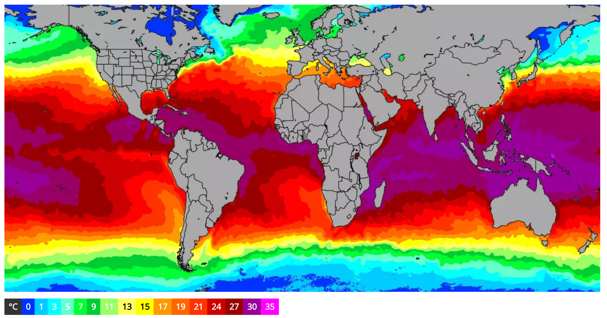

# Biology IA
Technician near Lab 7a

https://www.nature.com/articles/s41467-019-08457-x
https://www.iucn.org/resources/issues-briefs/ocean-warming

## Alginate beads chlorophyll
### effect of temperature
- water bath to change temperature
### effect of chlorophyll concentration
- prepare a stock of chlorophyll source (e.g. spinach, green algae) and for concentrations dilute it so that ratio of 2:8 totalling the 10ml mixture of alginate and chlorophyll source
- this can be good to see the effect which chlorophyll is having and where it is no longer the limiting factor at r.t.p and set concentration (e.g. for preliminary, to determine at what concentration to do it)
### Effect of CO2
Ocean is a massive carbon sink, CO2 emission increase absorbed by seas, what effect might this have on photosynthesising organisms in the oceans?
### Phytoplankton
Important to food chains as the producers
- Effect which rising temperature and CO2 emissions might have on them
Could also do something like green algae or small algae to model this if not possible, or as an entire alternative as I think it works fine without the phytoplankton. The article used phytoplankton though.

## temp as preliminary, pH as practical?

look at the effect of 

measure density by colorimeter or by mass
growth over time

growing culture, change pH
perhaps look at effect of temperature as prelim

## prelim
how long to let experiment run for
"learn about" the importance of the alginate bead size, etc.

## IA
look at effect of pH, after x hours take a sample and put it in colorimeter

