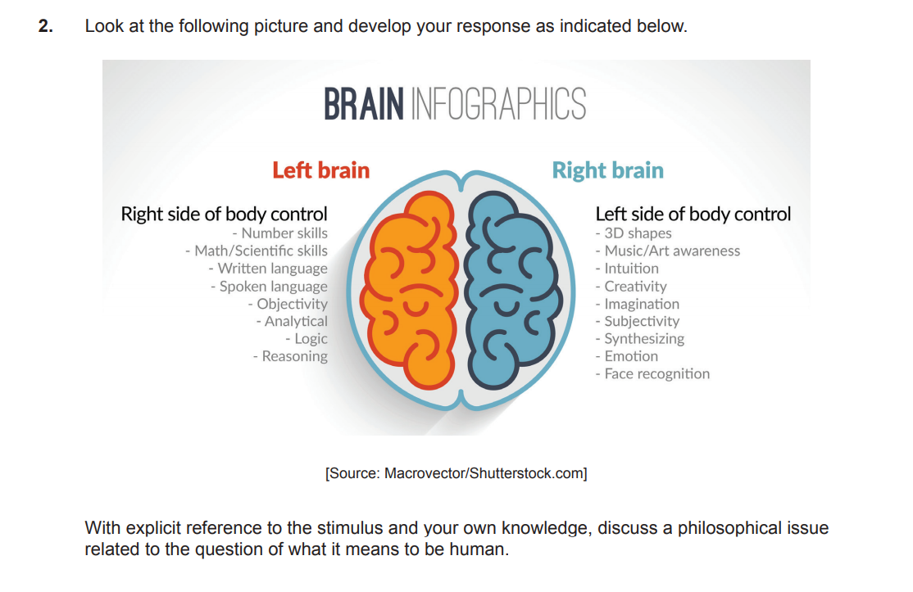

# E03 Core theme

The stimulus shows an infographic of the brain suggesting that different areas of the brain controls body movement and are where things such as language, reasoning, creativity, and intuition take place. The infographic however, doesn’t explicitly mention if areas of the brain control these things as well as the body or are simply where they take place. Furthermore, the question remain of why these things happen at all. The infographic therefore might only suggest that current understanding of the brain is limited to where things in the brain take place and a broad understanding of how. This raises the issue of why consciousness arises and how it interacts with the brain and body. This question is important the relationship between these parts of being human may influence the way humans should behave and prioritise. For example, the infographic could be read to suggest that the body’s desires should be limited and controlled so that some mind inside the brain, controlling and receiving the sense perception, can be the real focus of awareness. Or perhaps that there is no such thing as a separate mind and these functions taking place in the brain are all there is to consciousness and the mind is the system’s awareness attempting to recognise itself. The way which the mind and body interact then and what they are is important, as if it is incoherent then views on how to live which base themselves on mind and body positions perhaps should be discarded. 

At first sight it might appear that human beings are primarily thinking things, and the body and mind are separate, and there is something other than the body in control. This might be partially supported by the infographic, the brain could act as a centre for something which controls the body and where consciousness takes place. Because there is a relationship between the mind and body then, the question of how the two interact and the way this should be done arises. One possible solution comes from the idea of Samsara in ancient Hindu thought. It seems from personal experience that there is a distinct mind and body and that life is an endless cycle which humans are unable to overcome, the impossibility of overcoming this often brings mental despair. Often, this despair comes from trying to preserve and indulge the changing physical parts of life and therefore is a result of focus upon the body and constant appeasing of its needs. The mind and body then are separate categories in a spiritual conflict of humans striving towards a state of higher enlightenment. One possibility which comes from this is the ascetic idea that the body must be subdued and disciplined under the mind by denying it. This might allow higher functioning of the mind and advantages to reaching a higher state if suffering is a result of bodily focus. 

One criticism which arises might be that this view assumes a dualism of the mind and body without offering sufficient justification other than personal experience which could be doubted or questioned, or circular logic in arguing from the beliefs in spiritual conflict to separate substances of mind and body. The infographic could raise the issue that, being part of the body and the centre of many of the cognitive features specific to what we consider consciousness, subduing the body is counter to enhancing the mind. If the mind is part of the body, then perhaps it is not productive to deny what it desires. Some might argue that a craving for food or leisure is simply a biological response to being hungry or stressed and it will improve the brain’s, and perhaps therefore consciousness’ and the mind’s, functioning. Furthermore, if this is the case, surely asceticism does the opposite of what it aims towards if it results in greater, unnecessary, suffering and more intense bodily desires. 

Firstly, it may not be necessary that they are different distinct substances, or that they are a single substance. The view could be applied to both assumed dualism and monism as it simply provides a narrative of the human condition: how it feels to want and need things, and how these desires can be counter to one’s happiness. Therefore, even if the criticism of justification and assumptions is correct, we can still interpret parts of ancient Hindu thought as useful and asceticism as a conclusion. If we interpret the stimulus as suggesting the brain is all there is to consciousness, then the narrative of a conflict between a conscious and non-conscious body towards enlightenment still holds in a different way. From this, perhaps narratives of the human condition and the relationship between mind and body are more effective than philosophical theories of the nature of reality in what the mind and body actually are as they do not directly rely on one particular theory. Furthermore, it could be argued that asceticism doesn’t do the opposite of what it aims to because it is not a complete denial of the body’s needs but a denial of superfluous desires and physical longing for the something changing to be permanent. The suggestion that these desires are simply the body’s needs is therefore incorrect, because these are not the things which are denied.

Nonetheless, it could still be argued that wanting physical things and focusing on the body might not be a need to stay alive, but one to remain mentally well and that denying these desires by rejecting them completely does result in more mental distress and a greater focus on what one doesn’t have. Furthermore, asceticism is not the only conclusion which can be drawn from this narrative. Another alternative is the Buddhist Middle Way between the ideas of eternalism, where there is some eternal part of humans, and annihilationalism, where there is no lasting part of a human, and the extremes of asceticism or opulent indulgence. This is more similar to the conclusion reached previously of not denying the needs but just not giving in to every indulgence. The difference however is that there is no attempt to subdue the body or a superiority of the mind. The concept of anatta, there being no self, is reached by the argument that if there was a separate self it would be permanent but as there are no permanent psychological states it cannot be. Furthermore, if there was a self it would not be permanently the same, as nothing else is and there is no reason to assume it is different, and the self appears to change. The self then is a changing stream of consciousness and the body is a changing physical thing. There is again no necessary reason why this must correspond to a particular philosophy of mind, but there is a distinction made that there is no eternal soul or mind and all substances are changeable. Suffering in the human condition is therefore the attempt to keep things from changing, which could be said to explain why asceticism might be ineffective as it is an attempt to keep the mind from changing and building a superior relationship between the mind and body. Furthermore it can be tied to the idea of life as a cycle which humans are trapped in, in this case it is a cycle of change and humans want to remain. The higher state of enlightenment is then accepting change to resolve this conflicting cycle. This means that one must care for the body but not make it a focus, as one must accept it as impermanent, and also the mind.

However, it could be argued that these ancient views are outdated and no longer relevant in the current scientific paradigm or the post-modern episteme which rejects such meta-narratives. Foucault’s concept of the episteme, an unconscious knowledge and language framework which is the base for the way we see and interpret the world, applies well here. The ancient views developed in very different epistemes with different knowledge and value systems which are not currently held. It could therefore be argued that there is an incompatibility of language and knowledge between the ancient views and the contemporary episteme, it is impossible to properly understand the ancient views in their proper cultural and epistemic context in the episteme. Even further to this argument could be the idea that the views are outdated due to the postmodernist movement rejecting meta-narratives and previous value frameworks

However, while it is true that there is a different context to understanding the ancient views, this does not mean we are unable to interact with them. Foucault claims it is possible for different epistemes to interact, and the blind acceptance of the postmodernist idea is contrary to its aims. Furthermore, it could be argued that even if there is a barrier to some external real version of the original ancient views, their modern interpretation is still valuable and relevant. It is also the case that these views developed over time and continue to do so, so it might be incorrect to treat them as an isolated event in a different context.

Another interpretation of the stimulus could easily be that the areas of the brain show distinct functions, and that these functions are all there is to consciousness. This functionalist interpretation might pose a further challenge to the Hindu views as it directly opposes the idea of there being something more than just the physical and that the functions which produce consciousness are all there is. It also further poses the issue that there might not be a spiritual struggle as focus on the body is just focus on the functions which support the mind and therefore perhaps necessary. However, there is not much issue found with Buddhist thought as the idea that different realisations of the same functions could allow for continued consciousness may align with the belief in a continued consciousness or state after death. Further to this, functionalism does not identify consciousness with an external entity or specific anatomy, and the concept of anatta might be able to link to parts of functionalism in that the concept of the mind, or some self, is not a real thing but just the system’s self awareness trying to consider itself. This can be combined with the idea of the self as not being something other than an ever changing flow of consciousness and not something real in itself.

However, it could be argued that neither functionalism nor the ancient views provide a coherent philosophy of mind. Functionalism could be said to focus on the psychological aspects of the mind, the easy problem of consciousness in how it works, and the ancient views as a way to understand how the relationship between mind and body influence the human condition and how to live. Neither address the hard problem of consciousness, why non-conscious matter is conscious to begin with and why consciousness exists. Consciousness cannot just be a specific set of functions, as mental functions vary from individual to individual and this does not explain why some functions collectively give rise to consciousness and others not. Consciousness might be better defined as  a state for which there something it is like to be in that state. Even if we know everything about how a mental state works, we do not know what it is like to be that mental state or to suppose that the mental state is conscious. Philosophical zombies present a challenge to the idea that functionalism adequately explains consciousness. The zombie has no qualia and there is nothing there is like to be that zombie, yet it behaves and reacts perfectly like a human. The functions which take place in a conscious human therefore take place, but there is no way to determine if the zombie is conscious or not, and performing all the functions doesn’t mean it is, as Chalmers argues.

Nonetheless, it could be argued that dualist explanations of consciousness are unable to present a solution to how consciousness works and only provide a phenomenal explanation of consciousness as there is the problem of mind-body interaction. Therefore, perhaps functionalism fails in providing an answer to the hard problem of consciousness but it provides a satisfactory solution to the easy problem and builds towards a framework which can accommodate for a way to treat this relationship and live as a human with something like a meta-narrative explanation of the human condition as related to the mind and body. Chalmers provides the possibility of naturalistic dualism, even though the mind might not be able to be explained physically, it might still be part of the universe and same realm and be able to be explained by some other framework without the need for some mysterious entity

To conclude, the ascetic view suffers from assuming dualism and becomes less convincing without the dualist perspective. The Buddhist views become more convincing as a narrative describing the human condition, and are reconcilable with theories of mind and body, for example with functionalism, and it does not fail in what it attempts to do as it does not try to make claims about the nature of the mind and body. Yet, it is able to be combined with functionalism as an explanation for the easy problem of consciousness and leave open the possibility of another explanation for the hard problem of consciousness by interacting with something such as Chalmers’ idea of naturalistic dualism. The mind then, is a conscious state which arises as an interaction of functions involving a fundamental part of the non-permanent universe, and there is a need to accept this non immutability and balance the care for both the mind and body as they are both a part of one and changing.

