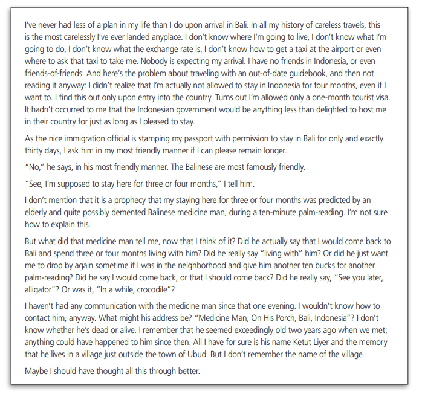

# Eat, Pray, Love

Genre: travelogue, memoir
Purpose: entretain, vicarious experience, to record/store

How purpose is achieved:
- satire of travelling for an epic quest 
- almost like pathos: the epic nature of this supernatural quest and the dullness of border guards
- structure
- questions
- situational irony
- stream of consciousness like: we get a sense of how all her thoughts are coming to her and are able to see how her sense of confidence starts deteriorating
- satire of entitlement: no understanding of the rules or regulations, or even what she is doing
- small phrases and colloquialisms/jokes
- lots of questions

