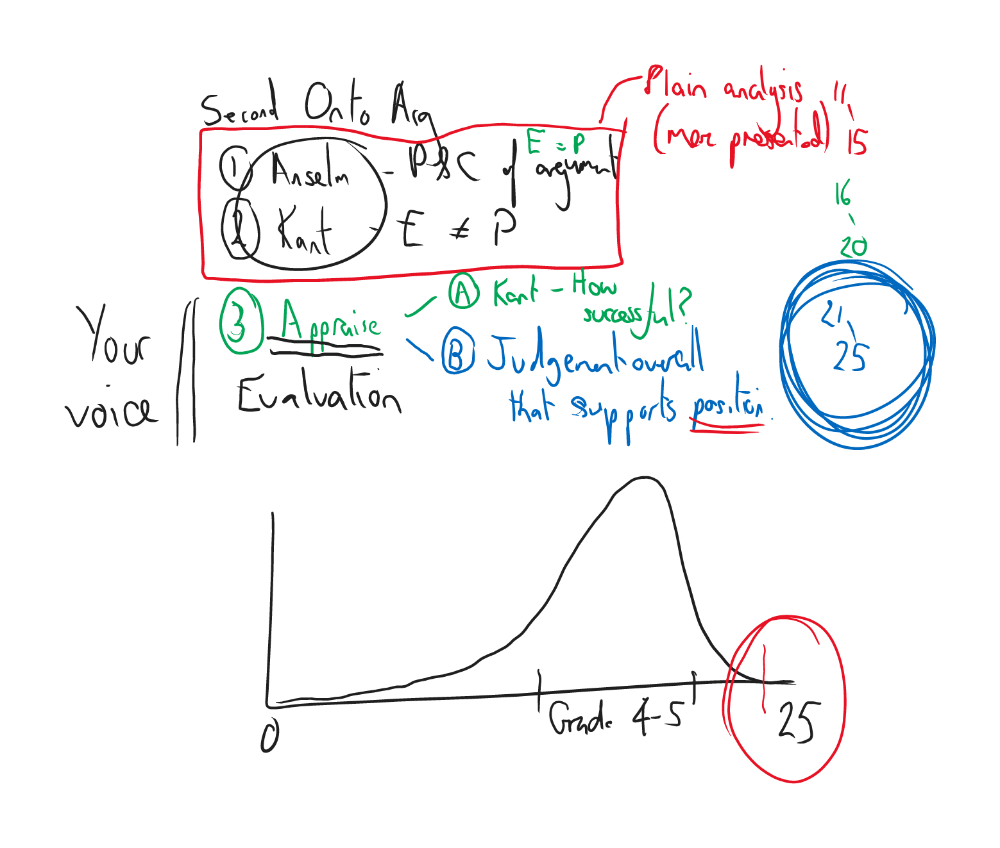

# Sustained critical analysis
"Contains well-developed critical analysis". This means you must be critical of your analysis and *sustain it throughout* the essay, **leading** to something.

e.g. Anselmian Second Ontological Argument
1. Anselm: P&C of argument. No need to formally set it all out unless you're going to do something with the formal layout
2. Kant: E =/= P
3. Appraise
  1. Kant's argument: i.e. how successful is Kant?
  2. Judgement overall which is consistent and *supports*, indeed **validates**, your personal philosophical position. Early in the essay, this support can simply be removing the opposition, but later it is important that you give ***positive*** validation too.

"The response argues from a consistently held position about the essay"
- only in the top band.

1&2 is mere presentation. 3 is *your* voice, engaging with the philosophy and showing you have formed and justified your own opinions for a reason which builds something.

Marker perspective:
sees critical analysis: -> 16-20
sees  this again and again -> 18-20
sees your voice: -> 21-25

