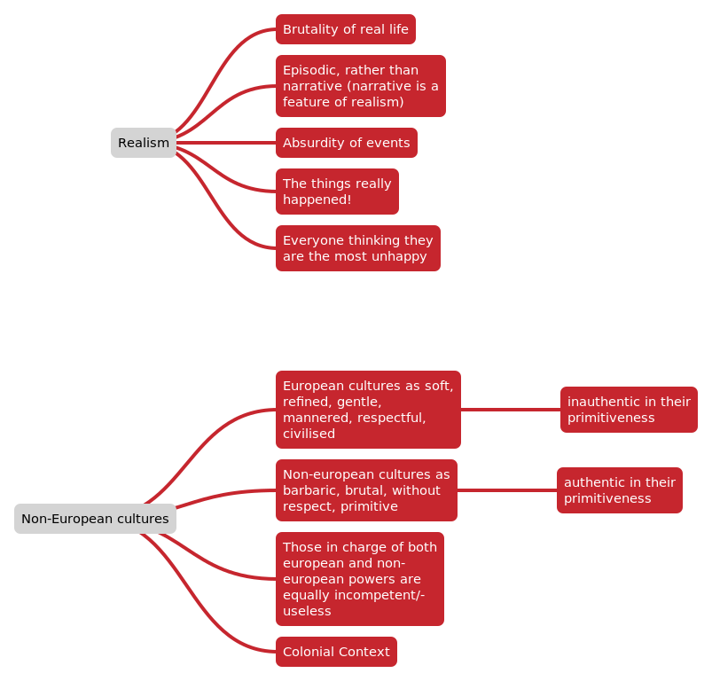

# ch 11-13

## The Moors:
- North African Muslim civilisation
- Simultaneously exoticised and eroticised, and feared as barbaric and cruel (as seen in Candide)

## *Orientalism*
- critical term coined by Edward Said
  - the patronising and exoticising of non-european cultures by the european/west.
  - implicitly othering the non-european
  - fetishising the other

Orientalism and the Erotic
- the harem-houses of women kept by the rich and powerful
- art of this was popular
- image of white woman being sexually exploited by the "dark and dangerous Moors" was one which combined the eroticism and sensuality with the fear that the exotic provoked
- Voltaire draws on the common tropes of the Moors and North Africans as both brutal and sexual

- superiority of the european "even our simple chambermaids, possesed more charms than are to be found in the whole of Africa"

- Aristotelian idea of hotness misused to the continent of Africa which was physically hotter to explain/justify european belief that africans were more violent and impulsive

- "I was witness...hot blood" - irony of European superiority
  - the europeans are also incredibly viscious, e.g. the Bulgars and the wars in the novel
- p 27: "At length..."
  - brutality of war
  - reminiscent of Bulgars and 100 years war
  - "five daily prayers" - hypocricy, reminiscent of the auto-da-fé s, pedantic rules and regulations of religion without being concerned about the moral reality of their actions. parralell to the inquisitor and cunegonde.

  - chapter 12 title "*The misfortunes of the old woman, continued*"

  - captivity
  - cannibalism
  - plague
  
  - evils either caused by God (natural evils) or those who believe in God (moral evils)/States (divine right link?)

  - she is the DAUGHTER of the pope, he should be celibate...

  - everyone thinks they have suffered the most, the difference is that some pretend that even though they've suffered so much that this is the best possibility, or that they still don't want to die (majority), or the few which want to die

  - life is a burden, "carrying a fardel"
  - optimism is an exaggeration of a natural part of survival, it is not a serious way to think about things
  - optimism about life is just because it is "better than death", but life itself is not good

